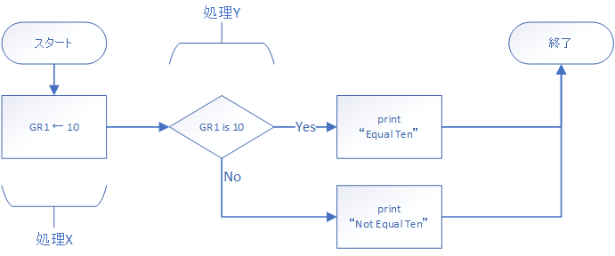
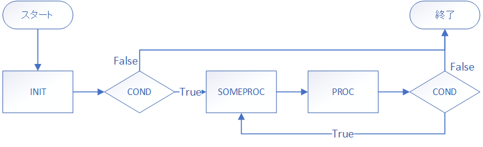

# 手を動かして学ぶ！コンピュータアーキテクチャとアセンブリ言語プログラミングの基本

## FizzBuzzを作ろう
FizzBuzzというのをご存知でしょうか。プログラミングを習う上で、基本となるいくつかの要素を抑えた、HelloWorldの次位にやる課題として有名です。今回はそんなFizzBuzzをMLFEにて実装していくことにします。本格的にアセンブリでのコーディングが始まります。それではよろしくお願いいたします。

### 要件定義
まずはFizzBuzzの要件定義をします。以下の通りです。

- FizzBuzzとは、連続した整数を使った言葉遊びゲームが基になっている問題です。
- 連続する数字は1から始まり、どこまでやるかの限界が与えられます。
- 数字が3の倍数の時は、Fizzと出力します。
- 数字が5の倍数の時は、Buzzと出力します。
- 数字が3の倍数かつ5の倍数の時はFizzBuzzと出力します。
- それ以外では数字を出力します。

以上の要件があります。一つ一つに何が必要か考えましょう。

まずは、if文のような条件分岐が必要になります。ループ構造にも倍数判定にも、何をするにも条件分岐がなければできません。

- if文のような条件分岐処理。

そして、連続した整数を作るためにforループのようなものが必要です。

- 初期値、継続条件、反復処理が与えられるループ構造。

また、高級言語なら`%`で済む剰余計算ですが、MLFEにはありません。このように新たな機能を実装するうえで関数という概念はとても大切です。

- アセンブリにおいて関数のようなものの実装。

大体以上ですかね。それではそれぞれを実現する方法を考えていきましょう！

### 条件分岐
ただ、条件分岐を実装しろと言われていも難しいので、以下のフローチャートを実装する形で条件分岐を実装していきましょう。



まずは`X`ですね。ここのGR1に代入した値が10か否かを判定するプログラムを作ります。

```
        LAD     GR1, 10
```
`LAD`は16bit整数値をレジスタに格納する命令です。まずはこんな感じで大丈夫でしょう。

`Y`が条件分岐の所です。条件分岐には比較命令とジャンプ命令を用います。  
比較命令は対象を比べフラグレジスタの値を上書きする命令です。  
ジャンプ命令は特定の条件の時に指定したアドレスの処理へ飛ぶ命令です。  
まずは比較命令である`CPA`命令から

```
CPA     r, addr
レジスタrの値とアドレスaddrが格納する値を比較する。

レジスタrの値をA、アドレスaddrが格納する値をBとした時、

A > B -> SF=0, ZF=0
A = B -> SF=0, ZF=1
A < B -> SF=1, ZF=0

とフラグレジスタの値を上書きします。
```

つまり
```
        CPA     GR1, TEN
TEN     DC      10
```

としたとき、GR1が10だったとき、フラグレジスタZFが1になります。

次に使うのがジャンプ命令です。とりあえず一覧をご覧ください。

```
        J       addr
フラグが特定の状態のときaddrが指すアドレスをプログラムカウンタへ入れる、つまりそこへ処理が飛ぶということ。
そうじゃないときには何もしない。
Jの部分には以下の命令が入る。

JUMP    無条件に飛ぶ
JPL     SF=0, ZF=0
JMI     SF=1
JNZ           ZF=0
JZE           ZF=1
JOV                 OF=1
```

`CPA`命令を実行すると、ZF=1になるので、`JZE`を使うと都合が良さそうです。

判定結果の出力する方法としては`OUT`を使いましょう。

プログラムは書けましたか？大体こんな感じになると思います。

```
PGM     START
        LAD     GR1, 10
        CPA     GR1, TEN
        JZE     EQUAL
        OUT     NO, MSGLEN
        RET
EQUAL   OUT     YES, MSGLEN
        RET

TEN     DC      10
YES     DC      'Equal Ten    \n'
NO      DC      'Not Equal Ten\n'
MSGLEN  DC      14
        END
```

`if_test.fe`と名前を付けて保存しました。実行してみます。

```
> pythom mlfe.py if_test.fe
Equal Ten
```

`LAD GR1, 10`の所を`LAD GR1, 5`とかに変えてみてください。

```
> python mlfe.py if_test.fe
Not Equal Ten
```

出来てますね。これが条件分岐の基本です。これからいっぱい出るので覚えていてください。

### ループ
それでは次にforループについて実装していきます。その前にforループってどのように処理が飛んでいるか一回確認しましょう。
forループをいくつかの部分に分けます。

```
for(INIT; COND; PROC){
    SOMEPROC
}
```

これの流れをループ記号を使わないフローチャートで書くとこういうようになると思います。



何となくどう書くか想像できますか？ようは条件分岐とループカウンタの組み合わせで行けます。

じゃあまずは`INIT`から行きますか、使いたい数値は、ループカウンタと繰り返し回数、それと出力の為のポート番号です。
for文には初期化をした後ループ判定を行いますので、それも実装します。

```
FORINIT LD      GR1, ZERO       ; counter
        LD      GR2, LOOPLIM    ; loop_limit
        LD      GR3, STDOUTD    ; stdout_decimal
        
        CPA     GR1, GR2        ; if counter<loop_limit
        JMI     FORLP           ;       -> FORLP
        JUMP    FOREND          ; else  -> FOREND
```

行末の`;`はその後の文字をコメントとして扱います。  
また、ラベルはFORINITにしました。ラベルもコメントのように情報を与えてくれるので使いましょう。


次にfor文の頭の部分を書きましょう。`INIT`は先ほど書いたので、`COND`部と`PROC`部を書きます。

```
FOR     ADDA    GR1, =1         ; counter += 1
        
        CPA     GR1, GR2        ; if counter<loop_limit
        JMI     FORLP           ;       -> FORLP
        JUMP    FOREND          ; else  -> FOREND
```

`SOMEPROC`では数値の出力でもしましょうか。ラベルは`FORLP`にしました。

```
FORLP   WRITE   GR3, GR1        ; print counter
        OUT     ='\n', =1       ; print line feed
        
        JUMP    FOR
```
最後の`JUMP FOR`はfor文の先頭まで戻るための無条件分岐です。`continue`みたいなものですね。

終了したときに飛ぶアドレスを作ります。その後することは無いので`RET`で良いです。
```
FOREND  RET
```

必要な数値は覚えていますか？`LOOPLIM`と`ZERO`と`STDOUTD`です。

```
LOOPLIM DC      10

ZERO    DC      0
STDOUTD DC      1
```

これで全体が出来上がりました。見てみましょう。

```
PGM     START
FORINIT LD      GR1, ZERO       ; counter
        LD      GR2, LOOPLIM    ; loop_limit
        LD      GR3, STDOUTD    ; stdout_decimal
        
        CPA     GR1, GR2        ; if counter<loop_limit
        JMI     FORLP           ;       -> FORLP
        JUMP    FOREND          ; else  -> FOREND
        
FOR     ADDA    GR1, =1         ; counter += 1
        
        CPA     GR1, GR2        ; if counter<loop_limit
        JMI     FORLP           ;       -> FORLP
        JUMP    FOREND          ; else  -> FOREND
        
FORLP   WRITE   GR3, GR1        ; print counter
        OUT     ='\n', =1       ; print line feed
        
        JUMP    FOR
FOREND  RET

LOOPLIM DC      10

ZERO    DC      0
STDOUTD DC      1
        END
```

```
> python mlfe.py for_test.fe
0
1
2
3
4
5
6
7
8
9
```

いいですね。これで以下のようなforループが実装できるようになりました。
```C
int i;
for(i = 0; i < 10; i++){
    printf("%d\n", i);
}
```

なお、whileループやdo-whileはこれよりも簡単に実装することができます。ぜひ要件定義からやってみてください。

### 関数
FizzBuzzの要件定義編、今回は関数の実装についてで最後です。では関数について考えてみましょう。

- 関数は独立した一連の処理に名前をつけたものを指す。
- `CALL`命令で呼び出し、`RET`で元の処理に帰る。
- 関数は引数を無数に持つことが出来る。
- 関数は返却値を１つ返すことが出来る。
- 関数内でレジスタの値が変わっても元の処理への影響は最小限に抑える。

返却値が１つしかないというのはプログラミング言語によっては扱いずらいように感じるかもしれませんが、アセンブリをがしがし書く上でこれはそれほど障害になりません。やってみれば分かると思います。

それでは、シンプルな関数`GREET`を定義しましょう。仕様は以下の通りです。

- 呼ばれると決められた文字列`Hello`を出力する。
- 引数も返却値も持たない。

簡単ですね。C言語っぽくかくならこんな感じでしょうか。

```C
void greet(){
    printf("Hello\n");
}
```

実装を始めます。`CALL`命令は、戻り番地をスタックに積み指定の番地に飛ぶ命令のことです。`RET`命令とセットで扱うことが多く、このような関数呼び出しにはよく使われます。

```
PGM     START
        CALL    GREET
        RET
GREET   OUT     ='Hello\n', =6
        RET
        END
```

`CALL`がやっと出たのであらためて`RET`の意味を説明します。`RET`はスタックに積まれたアドレスの次の番地に飛ぶ命令のことを言います。スタックには初期状態として`-1`が積まれていて、もしそれが`RET`によってプログラムカウンタに格納されてしまったときは、シミュレータは動作を正常に停止します。

急にスタックという言葉が出てきました。アセンブリを勉強しようとしている人がスタック構造が分からない人はいないと思いますが、念のため説明します。

スタック構造とは、データ構造の一種で、データを積み上げる`PUSH`、データを取り出す`POP`からなるデータ構造で、MLFEにおいては、下のアドレスから上の方へ伸びていくようにスタックが実装されていまず。

|アドレス|命令/データ|スタックポインタが指すアドレス|
|::|::|::|
|0|START||
|1|CALL FUNC||
|...|...||
|65533|...||
|65534|1|SP|
|65535|-1||

この状態で`PUSH 100`をするとアドレス65533に`100`が積まれスタックポインタが65533になります。またこの状態から`POP GR3`をすると、`1`がGR3に格納され、スタックポインタは65535になります。

`CALL`や`RET`はこのスタック構造を利用しており、呼び出し元のアドレスをスタックに保存しておくことで、`RET`をするだけですぐ元の処理が再開できる、というわけです。

大体わかりましたかね。次に、`GREET`を拡張した関数`RGREET`を定義します。

- 呼ばれると整数値である引数の回数分だけ繰り返し挨拶を出力する。
- 返却値は無い。

これはループによって実装できそうですね。しかし引数はどのように実装するのでしょうか。  
引数の実装方法は色々考えられますが、一番シンプルなのは特定のレジスタに引数が入っていることを期待する方法です。  
つまり`CALL FUNC`と呼ぶのは変わらないけど、`GR1`にループ回数が入っているだろうということを期待するということです。

じゃあ実装していきます。forについては先ほど説明したとおりです。

```
PGM     START
        LAD     GR1, 5          ; 繰り返す回数
        CALL    RGREET          ; rgreet(5)
        RET

; Repeat GREET
RGREET  LD      GR2, GR1        ; loop_limit
        LAD     GR1, 0          ; counter
        LAD     GR3, 1          ; stdout_dicimal
        
        CPA     GR1, GR2
        JMI     RGFLP
        JUMP    RGFED

; Repeat Greet FOR
RGFOR   ADDA    GR1, =1
        CPA     GR1, GR2
        JMI     RGFLP
        JUMP    RGFED

; Repeat Greet For LooP
RGFLP   OUT     ='Hello\n', =6
        JUMP    RGFOR

; Repeat Greet For EnD
RGFED   RET

        END
```

```
> python mlfe.py rgreet_test.fe
Hello
Hello
Hello
Hello
Hello
```

上手く動きましたね、しかしこの関数は一番初めにやった関数の要件定義を満たしていません。先ほどのソースコードをすこし変えてみました。実行してみてください。

```
PGM     START
        LAD     GR1, 5          ; 繰り返す回数
        
        LAD     GR10, 1         ; print GR2+GR3=
        OUT     ='GR2+GR3=', =8
        ADDA    GR11, GR2, GR3
        WRITE   GR10, GR11
        OUT     ='\n', =1
        
        CALL    RGREET          ; greet(5)
        
        OUT     ='GR2+GR3=', =8 ; print GR2+GR3=
        ADDA    GR11, GR2, GR3
        WRITE   GR10, GR11
        
        RET
; 以下のRGREETに変更なしにつき省略
```

```
> python mlfe.py rgreet_test.fe
GR2+GR3=0
Hello
Hello
Hello
Hello
Hello
GR2+GR3=6
```

わかりますかね、関数を呼ぶ前で変わってほしくないレジスタの値が変わってしまっているんです。呼び出した先で`GR2`と`GR3`を書き換えたので当然なのですが、呼び出し元では元に戻ってくれるととても助かりますよね。

これに関して解決は難しくないです。その関数の内側で変えたくないレジスタに関してスタックに退避しておいて、関数最後の`RET`の前に退避させていた値をレジスタに戻せば良いです。

```
; PGMに変化なし

; Repeat GREET
RGREET  PUSH    0, GR1
        PUSH    0, GR2
        PUSH    0, GR3
        
        LD      GR2, GR1        ; loop_limit
        LAD     GR1, 0          ; counter
        LAD     GR3, 1          ; stdout_dicimal
        
; 中の処理で変更点は無し

RGFED   POP     GR3
        POP     GR2
        POP     GR1
        RET

        END

```

何をしているのかと言いますと、関数に入った直後にレジスタGR1,GR2,GR3の値をスタックにプッシュして、それを関数の終わりにポップすることで元の処理に帰った時に何事もなかったかのように値はそのまま、ということです。

```
> python mlfe.py rgreet_test.fe
GR2+GR3=0
Hello
Hello
Hello
Hello
Hello
GR2+GR3=0
```

これでレジスタが書き換えられなくなりました。安心ですね。このようなテクニックを本書では関数化と呼んでいます。こういうことなんだなと思ってください。
また、複数のレジスタの退避は`RPUSH`、`RPOP`マクロ命令にて書くことも出来ます。マニュアルを読んでみてね。

それではお次には引数があり返り値がある関数についてです。  
こんな関数を定義します。

- 関数名は`UPPER`、小文字を与えられたとき大文字にして返す。
- `a`→`A`から`z`→`Z`など
- 小文字以外の文字が渡された時、返却値は0となりエラーが起きたことを返します。
- 引数はGR1、返り値はGR0に格納することにします。

何をどうすれば良いかわかりますか？まずは小文字かどうかの判定を行うことから考えてみます。  
C言語っぽく書くならこんな感じですね。

```C
if('a' <= charctor && charctor <= 'z'){}
```

```
        LAD     GR2, 'a'
        LAD     GR3, 'z'
        CPA     GR2, GR1            ; 'a' <= c
        JPL     UNLCE               ;   false -> UNLCE
        CPA     GR1, GR3            ; c <= `z`
        JPL     UNLCE               ;   false -> UNLCE
```

次に小文字を大文字に変換する処理を行います。ASCIIコードの`a`は97、`A`は65、つまり小文字が格納してあるレジスタから`97-65=32`引き算すれば良いですね。

```C
charctor -= 'a' - 'A'
```

返り値はGR0に入れるので値の移動をしてから引き算します。

```
        LD      GR0, GR1
        SUBA    GR0, =32
```

エラーが起きたときの処理も書きます。

```
; Upper Not Lower Case Error
UNLCE   LAD     GR0, 0
        RET
```

あとは関数の始めと最後に`POP`と`PUSH`を入れる関数化を行えば、完成です。  
呼び出す側のエラー処理については書いておきました。読んで何がされているか確認してみてください。

```
PGM     START
        LAD     GR1, 'a'
        LD      GR2, STDOUT
        
        CALL    UPPER
        
        CPA     GR0, NULL
        JZE     ERROR
        WRITE   GR2, GR0
        RET
        
ERROR   WRITE   GR2, GR1
        OUT     =' is not lower case\n', =19
        RET

; UPPER
UPPER   RPUSH   1, 3
        LAD     GR2, 'a'
        LAD     GR3, 'z'
        CPA     GR2, GR1            ; 'a' <= c
        JPL     UNLCE
        CPA     GR1, GR3            ; c <= `z`
        JPL     UNLCE
        LD      GR0, GR1
        SUBA    GR0, =32
        RPOP    1, 3
        RET
; Upper Not Lower Case Error
UNLCE    LAD     GR0, 0
        RPOP    1, 3
        RET

STDOUT  DC      0
NULL    DC      0

        END
```

```
> python mlfe.py upper_test.fe
A
```

二行目の`LAD GR1, 'a'`の部分を`z`とか`X`とか`@`とかにしてみてください。

```
> python mlfe.py upper_test.fe
Z
```

```
> python mlfe.py upper_test.fe
X is not lower case
```

```
> python mlfe.py upper_test.fe
@ is not lower case
```

お疲れさまでした！次回はFizzBuzzを実装していきますよ！

## まとめ

- FizzBuzzとはプログラミングの初心者向け課題でよく出る問題。
- FizzBuzzの為に`条件分岐`、 `ループ構造`、 `関数`が必要。
- 条件分岐には比較命令とジャンプ命令を用いて行う。
- ループ構造は条件分岐とループカウンタを用いて実装する。
- 関数は`CALL`と`RET`を用いて実装する。
- 関数内で汎用レジスタの値が書き換わるときはレジスタ退避を行うと便利。
- 関数の引数は特定のレジスタに引数が入っていることを期待するという実装がある。
- 関数の返却値は特定のレジスタだけレジスタ退避を行わないという実装がある。