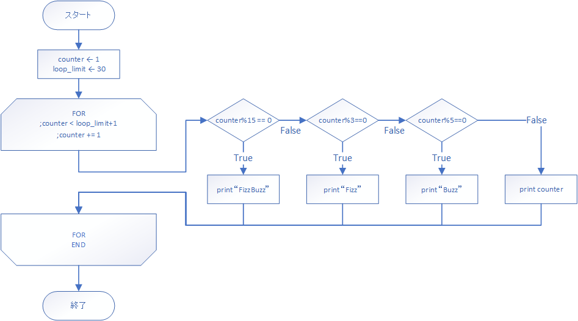

# 手を動かして学ぶ！コンピュータアーキテクチャとアセンブリ言語プログラミングの基本

## FizzBuzzを作ろう（実装編）

前回の内容は理解できましたか？前回の内容をちらちら確認しながらやることをお勧めします。それでは始めていきます！

### FizzBuzzのフローチャート

これから作るFizzBuzzプログラムですが、以下のフローチャートを参考にプログラミングしていきます。



それでは段階を踏んでいきましょう。まずは必要な数値の確認と初期値の格納を行います。

### 必要な初期値

どんな数値とデータが必要かあらためて考えてみます。

|名称|意味|割当|
|::|::|::|
|counter|ループカウンタ|GR1|
|loop_limit|カウンタの限界値|GR2|
|stdout_decimal|符号付き十進数出力のポート番号|GR3|
|selector_mod|MOD関数の為の引数|GR4|
|stdout|標準出力のポート番号|GR5|
|line_feed|改行文字|GR6|
|str_Fizz|`Fizz`という文字列|アドレス`FZ`|
|str_Buzz|`Buzz`という文字列|アドレス`BZ`|

```
FORINIT LD      GR1, ONE        ; counter
        LD      GR2, LOOPLIM    ; loop_limit
        LD      GR3, STDOUTD    ; stdout_decimal
        LAD     GR4, 0          ; selector_mod
        LD      GR5, STDOUT     ; stdout
        LD      GR6, LF         ; line_feed

FZ      DC      'Fizz'
BZ      DC      'Buzz'
```

使うのはこんな感じですね。確認してください。

### ループ部分の実装
ループ回数は30としたいと思います。
ここもほとんど前回やったものが使えますね。しかし`LOOPLIM`はやる回数+1することを確認してください。

```C
for(counter = 1; counter < loop_limit + 1; counter += 1){
    some_proc();
}
```

何故かというと、私たちはFizzBuzzをやるうえで1から30までの数列を生成したいわけですが、loop_limitが30だと1から29までしかカウンタが進まないからです。

```
PGM     START
FORINIT LD      GR1, ONE        ; counter
        LD      GR2, LOOPLIM    ; loop_limit
        LD      GR3, STDOUTD    ; stdout_decimal
        
        CPA     GR1, GR2        ; if counter<loop_limit
        JMI     FORLP           ;       -> FORLP
        JUMP    FOREND          ; else  -> FOREND
        
FOR     ADDA    GR1, ONE        ; counter += 1
        
        CPA     GR1, GR2        ; if counter<loop_limit
        JMI     FORLP           ;       -> FORLP
        JUMP    FOREND          ; else  -> FOREND
        
FORLP   WRITE   GR3, GR1        ; print counter
        OUT     ='\n', =1       ; print line feed
        
        JUMP    FOR
FOREND  RET

LOOPLIM DC      31

ZERO    DC      0
ONE     DC      1
STDOUTD DC      1
        END
```

これからFizzBuzzを実装するにあたって、上の`FORLP`部分を変えるわけですね。

### ＭOD関数の実装

MOD計算、剰余演算はどのように実装するか。CPUによっては除算命令`DIV`をするとついでに余りも出るみたいな実装もありますが、MLFEにはありません。  
今回はソフトウェア的に剰余演算ができるようにMOD関数を実装してみたいと思います。  
以下のように定義します。

- 名前はMOD
- 引数として割られる方と割る方と数値二つを要求する。
- 返却値は剰余演算をした結果。
- 返却値の値によってフラグレジスタが書き換わる。

```C
// X % Y -> return value
int mod(int X, int Y){
    int result = X % Y;
    FR(result);
    return result;
}
```

ところで四則演算しかない状態で剰余を出すにはどうすればよいかわかりますか？  
以下のような手順で生成することができます。

1. X / Y = a
2. Y * a = b
3. X - b = R


となります。必要な値は

|記号|意味|
|::|::|
|X|割られる方|
|Y|割る方|
|a/b|計算途中の値を入れておく変数。<br>以降使わなければ上書きしても構わない。|
|R|計算結果|

今回FizzBuzzを実装するうえで、`X`はcounterである`GR1`、`Y`はselector_modである`GR4`です。`R`は返却値なので`GR0`としましょう。`a/b`は何でもいいです。今回はレジスタ退避を行い処理元に影響を与えないようにした`GR2`にします。

```
; MOD(GR1, GR4) -> GR0
; GR0 result
; GR1 counter
; GR2 temp
; GR4 selector
MOD     PUSH    0, GR2
        DIVA    GR2, GR1, GR4   ; GR2 = GR1 / GR4
        MULA    GR2, GR4        ; GR2 *= GR4
        SUBA    GR2, GR1, GR2   ; GR2 = GR1 - GR2
        LD      GR0, GR2
        CPA     GR0, ZERO
        POP     GR2
        RET
```

この関数をテストしてみましょう。以下のようなソースコードを実行します。

```
PGM     START
        LAD     GR1, 11         ; X
        LAD     GR4, 3          ; Y
        
        LD      GR2, STDOUTD
        CALL    MOD
        WRITE   GR2, GR0
        RET

MOD     ; 省略

STDOUTD DC      1
ZERO    DC      0
        END
```

上手く動きましたか？`X`と`Y`の値を変えて実行してみてくださいね。

### 条件分岐部分の実装

`FORLP`の中身の条件分岐部分について考えてみます。C言語で言うと`if-else if-else`のような構造の実装をしていきます。  
まずは、FizzBuzzを出力するか否かだけを考えてみます。MOD関数は実装したのでそれを使うだけです。

```C
for(counter = 1; counter < loop_limit + 1; counter += 1){
    if(mod(counter, 15) == 0){
        outfb();
    }
}
```

```
FORLP   LAD     GR4, 15
        CALL    MOD
        JZE     OUTFB
        
        JUMP    FOR

OUTFB   OUT     FZ, =8
        JUMP    FOR

```

アセンブリを見ていると`CALL MOD`の返却値を活用しているようには見えませんが、MOD関数内でフラグレジスタを書き換えており、それを利用して`JZE`でジャンプしています。

また、`OUT FZ, =8`という記述は、アドレス`FZ`から8文字読みだして出力という意味がありますが、必要な初期値の項で`FZ DC 'Fizz'` `BZ DC 'Buzz'`と定義していることを覚えていますか？これは一見違和感のある呼び出しですが、実行する上の誤りはありません。

ここで一度`DC`がどのようにメモリを確保しているのか考えてみます。  
DCは数値と文字列の確保をするアセンブラ命令です。確保できるのは、10進数、16進数、文字列、アドレス定数ですが、連続した領域を確保する文字列について考えてみます。

```
PGM     START
        RET
FZ      DC      'Fizz'
BZ      DC      'Buzz'
        END
```

以上のソースを記述するとメモリはこのように確保されます。

```
    0 START
    1 RET
    2 DATA    70
    3 DATA    105
    4 DATA    122
    5 DATA    122
    6 DATA    66
    7 DATA    117
    8 DATA    122
    9 DATA    122
   10 END
```

ここで重要なのは、ラベル`FZ`もラベル`BZ`も特定のアドレスに名前を付けているだけで確保した領域に名前を付けている訳ではないということです。  
つまりここで`OUT FZ, =4`と書くとアドレス2から5までを取り出す、`OUT FZ, =8`と書くとアドレス2から9まで取り出すということを意味しており、アセンブリ上で別のラベルとして記述しようが展開されると連続した領域でしかないということです。

FizzBuzzの実装に戻ります。次にFizz出力とBuzz出力について考えてみます。

```C
for(counter = 1; counter < loop_limit + 1; counter += 1){
    if(mod(counter, 15) == 0){
        outfb();
    }else if(mod(counter, 3) == 0){
        outf();
    }else if(mod(counter, 5) == 0){
        outb();
    }
}
```

```
FORLP   LAD     GR4, 15         ; if counter%15 == 0
        CALL    MOD
        JZE     OUTFB           ;       -> print "FizzBuzz"
        
        LAD     GR4, 3          ; if counter%3 == 0
        CALL    MOD
        JZE     OUTF            ;       -> print "Fizz"
        
        LAD     GR4, 5          ; if counter%5 == 0
        CALL    MOD
        JZE     OUTB            ;       -> print "Buzz"

OUTFB   OUT     FZ, =8
        JUMP    FOR
OUTF    OUT     FZ, =4
        JUMP    FOR
OUTB    OUT     BZ, =4
        JUMP    FOR

```

ちょっと記述が長くなりましたが、やっていることはたいしたことではありません。上から順に実行していって、MOD関数で割り切れたときには`OUTFB`などの処理に飛ぶ、そうではなければ次の条件文に移る、それだけです。

次に`else`部分、つまり数値を出力する部分ですが、これはどの条件にも引っかからなかったやつということになります。なので必ず実行するように記述すれば良いです。

```C
for(counter = 1; counter < loop_limit + 1; counter += 1){
    if(mod(counter, 15) == 0){
        outfb();
    }else if(mod(counter, 3) == 0){
        outf();
    }else if(mod(counter, 5) == 0){
        outb();
    }else{
        printf("%d", counter);
    }
}
```

```
FORLP   LAD     GR4, 15         ; if counter%15 == 0
        ; 省略
        JZE     OUTB            ;       -> print Buzz
        
        WRITE   GR3, GR1        ; else  -> print counter
        
        JUMP FOR
        
OUTFB  ; 省略
OUTF   ; 省略
OUTB   ; 省略
```

これで`FORLP`の全てが記述できました。

### ソースコードの結合

最後に、このままだと改行無しに出力されてしまうので、`FOR`の`ADDA GR1, ONE`の後に以下のように記述します。

```
        WRITE   GR5, GR6
```
ループが回るたびに、標準出力にラインフィードを送る、つまり改行を行うという意味になります。
もろもろ書いて結合すると、以下のようなソースコードになります。

```
PGM     START
FORINIT LD      GR1, ONE        ; counter
        LD      GR2, LOOPLIM    ; loop_limit
        LD      GR3, STDOUTD    ; stdout_decimal
        LAD     GR4, 0          ; selector_mod
        LD      GR5, STDOUT     ; stdout
        LD      GR6, LF         ; line_feed
        
        CPA     GR1, GR2        ; if counter<loop_limit
        JMI     FORLP           ;       -> FORLP
        JUMP    FOREND          ; else  -> FOREND
        
FOR     ADDA    GR1, ONE        ; counter += 1
        
        WRITE   GR5, GR6        ; print line feed
        
        CPA     GR1, GR2        ; if counter<loop_limit
        JMI     FORLP           ;       -> FORLP
        JUMP    FOREND          ; else  -> FOREND
        
FORLP   LAD     GR4, 15         ; if counter%15 == 0
        CALL    MOD
        JZE     OUTFB           ;       -> print FizzBuzz
        
        LAD     GR4, 3          ; if counter%3 == 0
        CALL    MOD
        JZE     OUTF            ;       -> print Fizz
        
        LAD     GR4, 5          ; if counter%5 == 0
        CALL    MOD
        JZE     OUTB            ;       -> print Buzz
        
        WRITE   GR3, GR1        ; else  -> print counter
        
        JUMP FOR
        
OUTFB   OUT     FZ, =8
        JUMP    FOR
OUTF    OUT     FZ, =4
        JUMP    FOR
OUTB    OUT     BZ, =4
        JUMP    FOR
        
FOREND  RET

; MOD(GR1, GR4) -> GR0
; GR0 MOD result
; GR1 counter
; GR2 temp
; GR4 selector
MOD     PUSH    0, GR2
        DIVA    GR2, GR1, GR4
        MULA    GR2, GR4
        SUBA    GR2, GR1, GR2
        LD      GR0, GR2
        CPA     GR0, ZERO
        POP     GR2
        RET

FZ      DC      'Fizz'
BZ      DC      'Buzz'

LOOPLIM DC      31

ZERO    DC      0
ONE     DC      1
STDOUTD DC      1

STDOUT  DC      0
LF      DC      '\n'

        END
```

実行してみましょう。上手く動いたらよくできました！上手く動かなかったら何がおかしいのか考えてみて！  
できれば丸写しはしないで何がダメなのかじっくり考えてみてね！

## まとめ

- FizzBuzzのアルゴリズムは条件分岐とループ、MOD関数によって実装できる。
- 剰余演算は`X - (Y * (X / Y ))`
- 条件分岐はジャンプ命令と比較命令とフラグレジスタを用いて行う。
- `DC`命令は、書いたところの連続した領域に値を確保する。
- コメントとラベルをしっかりつける。
- 流れが難しくても処理を追跡して何がダメなのか考える！