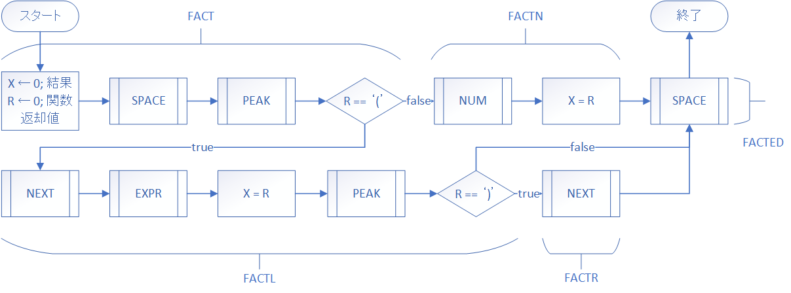

# 手を動かして学ぶ！コンピュータアーキテクチャとアセンブリ言語プログラミングの基本

## 計算機を作ろう（実装編）

さて前回はガッツリ再起下降構文解析について座学をしたのですが、あれの解説だけでじゃあやってくださいは困難だと思います。なぜなら再起下降構文解析しか解説しておらず、他に必要な様々なものについて全く触れていないからです。今回はそれも含めて考えてみて、計算機を完成までもっていきたいと思います。

### 前回のおさらい

一回前回のおさらいをしますか、前回は再起下降構文解析の手順を追いかけて、C言語で表記された一部の機能しか持たないような関数について触れ、その中で何となくイメージをしてくださったと思います。  
でも全然必要な機能が足りていないんですよ。例えば、まだ標準入力を取り込む方法とか文字配列から数値に変換する手順とか。なのでまずそこから始めていきましょう。

### 標準入力から文字を取り込む

さて標準入力から文字を取り込みます。MLFEには主に三つ取り込む方法があります。

一つ目は、`READ`命令を使うことです。

```
        READ    GR0, GR1        ; GR1 <- Port[GR0]
```

`READ`とは指定したポートから32bit分を指定レジスタに書き込む命令です。`GR0`がある第一オペランドがポートを指定するレジスタ、`GR1`がある第二オペランドがが格納先のレジスタです。

```
PGM     START
        CALL    READF
        RET

; READ Function
READF   READ    GR0, GR1
        WRITE   GR0, GR1
        RET
        END
```

このプログラムの中で`GR0`の値が更新されていないので`GR0`の値は`0`、標準入力はポート0なのでこれで大丈夫です。`GR1`に値が書き込まれたか確認するために`WRITE`命令を用いています。これを実行すると以下のようになると思います。

```
> python mlfe.py scantest.fe
hello
h
```

`scantest.fe`という名前で保存してみました。そのあと入力待ちの状態になるのでとりあえず`hello`と打ってみると`READ`命令は一回しか呼ばれていないので一文字しか取り込まれていません。この一文字だけ取り込んでレジスタに入れる命令が`READ`命令です。

これはMLFEにおいて最も基本的な方法です。あとは10文字取得したければ10回ループしてメモリに格納すれば良いんですが、いちいちループを実装するのは面倒ですよね。以前`OUT`マクロ命令という文字列の先頭アドレスと文字列数を指定すれば動作するものが出てきましたが、それの入力版があります。`IN`マクロ命令です。

```
PGM     START
        ;CALL    READF
        CALL    INF
        RET

; READ Function 省略

; IN Function
INF     IN      BUFF, LEN
        OUT     BUFF, LEN
        RET

BUFF    DS      256
LEN     DC      5

        END
```

`IN`マクロ命令は第一オペランドに格納先メモリの先頭番地、第二オペランドに文字数を入れたアドレスを入れると動作します。

実行してみます。

```
> python mlfe.py scantest.fe
helloworld
hello
```

`BUFF`は256語分格納できますが、`LEN`で5と指定しているため5文字しか格納されません。ちなみに10文字指定して`hello`しか入力せずエンターキーを押したときは、`READ`は5回しか実行されないためあと5回`READ`を実行しようとします。何も入力しないままエンターキーを押すと対象のメモリには`0`が格納されます。

`IN`マクロは、要は`READ`命令をループ構造で何度も呼び出しているだけなのでとても単純なものです。でもこれぶっちゃけ面倒ですよね？`BUFF`のようにバッファを作るのはしょうがないとしても例えば5文字だけ入力したらそのあと何度も入力を求めないで欲しいですよね？そんな方のために`SVC`命令というものから`scanf`関数を呼び出すことが出来ます。

```
PGM     START
        ;CALL    READF
        ;CALL    INF
        CALL    SCANFF
        RET

; READ Function 省略


; IN Function 省略

; SCANF Function
SCANFF  LAD     GR1, BUFF
        LD      GR2, FORMAT
        SVC     scanf
        SVC     printf
        RET

FORMAT  DC      's'
BUFF    DS      256

LEN     DC      5

        END
```

`SVC`とは、`OS`などの上位のシステムの機能を呼び出すための命令です。突然見慣れない命令が来ても焦る必要はないです。これは`CALL`命令と性質がよく似ていて、一連の処理を呼び出して終わったら元の場所に帰ってくるというものです。引数を渡したいときは主にレジスタを使って渡します。`SVC`命令は他に、現在時刻を取得する`time`、ソースコード上にも出ている`printf`、新しい領域を確保する`malloc`等があります。人によっては聞いたことある名前もあるかもしれないですが、それはユーザにイメージを持たせたいためにその名前にしているだけで仕様がそのままではないことはご了承お願いします。

```
> python mlfe.py scantest.fe
helloworld
helloworld
```

`printf`は`GR1`にデータバッファの先頭番地、`GR2`にはフォーマットを示す番号が入っていることを期待して動作します。他のフォーマットに関してはマニュアルを読んで欲しいのですが、注目すべきは長さの指定が無いことです。レジスタに先頭番地が入っていれば動くので一番簡単です。

今回はこの中で`scanf`を使おうと思います。何故なら簡単なので。それでは次に文字を数値に変換する方法についてです。


## 文字列を数値に変換する

文字列を数値に変換する方法ですが、`SVC`命令の中に`atoi`が…ありません。がんばって実装していきましょう。

さて実装の方法ですが、1文字を整数に変換する方法はわかりますか?FizzBuzzを作ろうの要件定義編で似たようなことをしたのですが、覚えていますでしょうか。

ASCIIコードの対応を振り返ってみましょう。必要な部分だけ抜粋します。

|10|文字|
|::|::|
|48|0|
|49|1|
|50|2|
|51|3|
|52|4|
|53|5|
|54|6|
|55|7|
|56|8|
|57|9|

`48`なら`0`、`57`なら`9`となっています。ということは、数値であることが分かっている（対象の文字が48以上57以下である）ならそのASCIIコードの数値から48引けばその数値になるということです。

これで1桁はできますね。じゃあ複数はどうするか、n桁目には取り出した数値に10のn-1乗かけてやって、最後に全部足せば行けそうじゃないですか？フローチャートにするとこんな感じ。


おそらく見ている人のほとんどが？マークが出ているはずなので、何か具体的な問題を解いてみますね。

このような文字列`S`を数値に変換することを考えます。

|| 0| 1| 2| 3|
|::|::|::|::|::|
|記号|3|2|1|SPACE|
|ASCII|51|50|49|32|

この文字列を`321`という数値に変換出来たら成功というわけですね。

まず`INIT`を実行します。変数の初期化を担うサブルーチンです。この`S`に文字列が入り、例えば`S[0]`という風に添え字を使って任意の文字にアクセスすることが出来ます。

次に`PEAK`です。変数`C`に`P`が指し示す記号`3`が代入されます。数値としては`51`ですね。

次に条件分岐です。ここでは`C`に入っているのが数字か否かを判定します。`47 < C < 58`が成り立つとき`C`は数値です。次に`C`の値をスタックにプッシュします。次に`NEXT`、`P`の値を1加算して指す位置を右へずらします。次に`I`に１つ加算します。

また条件分岐です。ほぼ同様なので簡潔にいきます。`C`の値である記号`2`がスタックにプッシュされ、`NEXT`が実行され、`I`がインクリメントされます。

三回目の条件分岐です。`C`の値である記号`1`がスタックにプッシュされ、`NEXT`が実行され、`I`がインクリメントされます。

上の部分の最後の条件分岐です。`C`にスペースが格納されますが、条件分岐で適合しないのでここで上の部分のループが終わりました。C言語っぽく書くとこんな感じになります。

```C
    
int c, i=0, j=0, t, x=0, r=0;
loop:
    c = peak();
    if(47 < c && c < 58){
        push(c);
        next();
        i++;
        goto loop;
    }
```

変数とスタックの状態はというと、

|変数|状態|
|::|::|
| P| 3|
| C|SPACE|
| I| 3|

スタックのアドレスはスタックポインタの位置から相対位置で示しています。

|アドレス|記号|ASCII|
|::|::|::|
| 0| 1|49|
| 1| 2|50|
| 2| 3|51|

こんな感じですね。確認してください。

それでは`DIGIT`を実行します。`DIGIT`は桁にあった`10`の乗数を返してくれる関数みたいなものです。`J`は`0`なので`10の0乗`で`1`です。

次に`POP`を実行します。スタックからポップした`1(49)`を変数`R`に代入します。

次に`C`に`R`の値から`48`引き算したもの、つまり文字を1桁の数値へ変換したものを代入します。

`T`に`C`と`T`を掛け算したものを代入します。現在は`C=1`、`T=1`なので`T`には`1`が入ります。

`X`に`T`を加算します。現在`X=0`、`T=1`となっているので、`X=1`になります。

`J`に`1`加算します。`J`は`0`から`1`になります。

下部の条件分岐です。`J < I`は`I`の値と比較することによって、下部ループの回数を明確にします。`J=1`、`I=3`なのでループ続行です。

C言語にするならこんな感じですね。

```C
    
do {
    t = digit(j);
    r = pop();
    c = r - 48;
    t *= c;
    x += t;
    j++;
}while(j < i);
```

じゃあ続きをしますね。

`DIGIT`を呼び出して`J`が`1`なので`T`に`10`が代入されます。`POP`を実行して`R`に`2(50)`を入れます。`C`に`R`から`48`引き算した値を入れます。`T`に`C`を掛け算して`T`は`20`になります。`T`の値を`X`に足し算します。`X`は`21`になります。`J`をインクリメントして、`J < I`、つまり`2 < 3`なのでループ続行です。

`DIGIT`を呼び出して`J`が`2`なので`T`に`100`が代入されます。`POP`を実行して`R`に`3(51)`を入れます。`C`に`R`から`48`引き算した値を入れます。`T`に`C`を掛け算して`T`は`300`になります。`T`の値を`X`に足し算します。`X`は`321`になります。`J`をインクリメントして、`J < I`、つまり`3 < 3`なのでループ終了です。

答え`321`が`X`に格納されました。関数ならここで`return x;`とするんでしょうね。

さあ文字列を数値に変換するアルゴリズムとしては以上の通りです。

要旨は話したのでできると思いますが、それぞれのこまごまとしたサブルーチンについてはソースを見れば十分に理解できると思うのでソースを示そうと思います。

なお、MLFE側に関しては、必要なデータ領域について先に説明しておこうと思います。

```
POS     DC      0       ; Pに該当、文字の特定の位置を指す
LEN     DC      0       ; 入力した文字の長さ
TEXT    DS      255     ; 文字列のバッファ
ONE     DC      1       ; 常に1
ZERO    DC      0       ; 常に0
```

- PEAK

```C
int peak(){
    if(pos < len){
        return text[pos];
    }
    return -1;
}
```

```
PEAK    RPUSH   1, 2
        LD      GR1, POS
        LD      GR2, LEN
        CPA     GR1, GR2
        JPL     PEAKOUT
        LD      GR0, TEXT, GR1
        JUMP    PEAKED
PEAKOUT LAD     GR0, -1
PEAKED  RPOP    1, 2
        RET
```

- NEXT

```C
void next(){
    pos++;
}
```

```
NEXT    PUSH    0, GR1
        LD      GR1, POS
        ADDA    GR1, ONE
        ST      GR1, POS
        POP     GR1
        RET
```

- DIGIT

```C
int digit(int n){
    int t = 1;
    if(n == 0){
        return t;
    }
    do {
        t *= 10;
        n--;
    }while(0 < n);
    return t;
}
```

```
GETDG   RPUSH   1, 2
        LAD     GR1, 1          ; t
        LD      GR2, GR0        ; n
        CPA     GR2, ZERO
        JZE     GETDGFN
GETDGLP MULA    GR1, =10
        SUBA    GR2, ONE
        CPA     GR2, ZERO
        JPL     GETDGLP
GETDGFN LD      GR0, GR1
        RPOP    1, 2
        RET
```

それでは、以上のプログラムを前提として、実装に参りたいと思います。

まずは`INIT`部ですね。

```
; int NUMber()
NUM     RPUSH   1, 6
        LAD     GR1, 0          ; c
        LAD     GR2, 0          ; i
        LAD     GR3, 0          ; j
        LAD     GR4, 0          ; t
        LAD     GR5, 0          ; x
        LAD     GR6, 0          ; r
```

次に上部条件分岐です。

```
; NUMber Upper LooP
NUMULP  CALL    PEAK            ; c <- peak()
        LD      GR1, GR0
        CPA     GR1, =48        ; if c < 48
        JMI     NUMBLP          ;     then goto bottom_loop
        CPA     GR1, =58        ; if 58 < c
        JPL     NUMBLP          ;     then goto bottom_loop
        PUSH    0, GR1          ; push(c)
        CALL    NEXT            ; NEXT
        ADDA    GR2, ONE        ; i = i + 1
        JUMP    NUMULP          ; continue
```

最後に下部ループです。

```
; NUMber Bottom LooP
NUMBLP  CALL    GETDG           ; t <- get_digit()
        LD      GR4, GR0
        POP     GR6             ; r <- pop()
        SUBA    GR6, =48        ; c <- r - 48
        LD      GR1, GR6
        MULA    GR4, GR1        ; t <- c * t
        ADDA    GR5, GR4        ; x <- x + t
        ADDA    GR3, ONE        ; j = j + 1
        CPA     GR3, GR2        ; if j < i
        JMI     NUMBLP          ;     then continue
        LD      GR0, GR5        ; return x;
        RPOP    1, 6
        RET
```

実装できましたでしょうか。それではそろそろ本題に移りますか。

### 実装しよう

実装に入ろうと思います。とりあえず下のソースコードを見てください。

```
PGM     START
        CALL    MAIN
        RET
MAIN    CALL    INIT
        CALL    EXPR
        CALL    FIN
ENDMAIN RET

; int NUMber() 省略

; int GETDiGit(GR3) 省略

; int PEAK() 省略

; void NEXT() 省略

EXPR    NOP
        RET
TERM    NOP
        RET
FACT    NOP
        RET
SPACE   NOP
        RET

INIT    RPUSH   1, 2
        LAD     GR1, TEXT
        LD      GR2, STR
        SVC     scanf
        LAD     GR2, 0
INITLP  ADDA    GR2, ONE
        LD      GR1, TEXT, GR2
        CPA     GR1, ZERO
        JNZ     INITLP
        ST      GR2, LEN
        RPOP    1, 2
        RET

FIN     LAD     GR10, 1
        WRITE   GR10, GR0
        RET


TEXT    DS      256
ZERO    DC      0
ONE     DC      1
POS     DC      0
LEN     DC      0
STR     DC      's'
        END
```

ちょい長いですね。ソースコード上部に`MAIN`ルーチンを作ってそこから実行していくような形にします。プロトタイプ宣言的なのは無いので安心してください。

`INIT`は文字列の読み込み、文字数カウントを行ってくれます。

`FIN`は最後に計算結果を出力します。

省略しているところは前までのやつで埋めてください。このソースコードにどんどん実装していこうと思います。

それでは`EXPR`、`TERM`、`FACT`、`SPACE`を実装していきます。もしかしたらやっていること自体はさっきの文字列から数値へ変換するものよりも簡単かも。

- EXPR

これ`EXPR = TERM, {("+"), TERM | ("-", TERM)}`を実装していきます。


これをMLFEにするとこのようになります。

```
; int EXPR()
EXPR    RPUSH   1, 2
        CALL    TERM            ; x <- term()
        LD      GR1, GR0
        LAD     GR2, 0          ; c <- 0
; EXPR LooP
EXPRLP  CALL    PEAK            ; c <- peak()
        LD      GR2, GR0
        CPA     GR2, ='+'       ; if c == '+'
        JZE     EXPRADD         ;     then goto ADD
        CPA     GR2, ='-'       ; if c == '-'
        JZE     EXPRSUB         ;     then goto SUB
        JUMP    EXPRBK          ; break
; EXPR ADD
EXPRADD CALL    NEXT            ; next()
        CALL    TERM            ; x = x + term()
        ADDA    GR1, GR0
        JUMP    EXPRLP          ; continue
; EXPR SUB
EXPRSUB CALL    NEXT            ; next()
        CALL    TERM            ; x = x - term()
        SUBA    GR1, GR0
        JUMP    EXPRLP          ; continue
; EXPR loop BreaK
EXPRBK  LD      GR0, GR1        ; return x
        RPOP    1, 2
        RET
```

これだけの単体テストが出来ないのがもどかしいですね、しょうがないです。`TERM`行きます。

- TERM

`TERM = FACT, {("*", FACT) | ("/", FACT)}`


ほぼ同じような内容ですね。どこが違うのかしっかり確認してください。

```
; int TERM()
TERM    RPUSH   1, 2
        CALL    FACT            ; x <- fact()
        LD      GR1, GR0
        LAD     GR2, 0          ; c <- 0
; TERM LooP
TERMLP  CALL    PEAK            ; c = peak()
        LD      GR2, GR0
        CPA     GR2, ='*'       ; if c == '*'
        JZE     TERMMUL         ;     then goto MUL
        CPA     GR2, ='/'       ; if c == '/'
        JZE     TERMDIV         ;     then goto DIV
        JUMP    TERMBK          ; break
; TERM MUL
TERMMUL CALL    NEXT            ; next()
        CALL    FACT            ; x = x * fact()
        MULA    GR1, GR0
        JUMP    TERMLP          ; continue
; TERM DIV
TERMDIV CALL    NEXT            ; next()
        CALL    FACT            ; x = x / fact()
        DIVA    GR1, GR0
        JUMP    TERMLP          ; continue
; TERM BreaK
TERMBK  LD      GR0, GR1        ; return x
        RPOP    1, 2
        RET
```

はい、それでは次の`FACT`の実装をしていきます。

- FACT

`FACT = [SPACE], ("(", EXPR, ")") | NUM, [SPACE]`



```
; int FACT()
FACT    PUSH    0, GR1
        LAD     GR1, 0          ; x
        CALL    SPACE           ; space()
        CALL    PEAK            ; if peak()!='('
        CPA     GR0, ='('
        JNZ     FACTN           ;     then goto NUM
; FACT Left parenthesis
FACTL   CALL    NEXT            ; next()
        CALL    EXPR            ; x = expr()
        LD      GR1, GR0
        CALL    PEAK            ; if peak==')'
        CPA     GR0, =')'
        JZE     FACTR           ;     then goto Right parenthesis
        JUMP    FACTED          ;     else goto end
; FACT Right parenthesis
FACTR   CALL    NEXT            ; next()
        JUMP    FACTED          ; goto end
; FACT Num
FACTN   CALL    NUM             ; x = number()
        LD      GR1, GR0
; FACT EnD
FACTED  CALL    SPACE           ; space()
        LD      GR0, GR1        ; return x
        POP     GR1
        RET
```

- SPACE

`SPACE = ? white space charactores ? (*スペース文字を除去する処理*)`

これはスペース除去機能です。やっていることとすれば、空白を飛ばして変数`P(POS)`の位置を進めているだけですね。


```
SPACE   RPUSH   0, 1
        LAD     GR1, 0          ; r
        CALL    PEAK            ; if peak() == ' '
        LD      GR1, GR0
        CPA     GR1, CSPACE
        JZE     SPACELP         ;     then goto loop
        JUMP    SPACEED         ;     else end
SPACELP CALL    NEXT            ; next()
        CALL    PEAK            ; if peak() == ' '
        LD      GR1, GR0
        CPA     GR1, CSPACE
        JZE     SPACELP         ;     then goto loop
SPACEED RPOP    0, 1
        RET
```

### 実行しよう

プログラムが完成しました！名前は`rdp.fe`で保存します。実行してみましょう。

```
> python mlfe.py rdp.fe
10*(3-99/3)+5
-295
```

お、上手く動いてそうですね。標準入力に文字が渡せればよいのでこんな風にも実行できます。

```
> echo "10 * (3 - 99 / 3) + 5" | py .\mlfe_v0.21.py textb\rdp.fe
-295
```

これは`Powershell 7.0.0`にて実行されています。お使いの環境に合わせて標準入力に文字を渡して実行してみてください。

ちなみに、このような入力は上手く動きません。

```
> echo "-1" | py .\mlfe_v0.21.py textb\rdp.fe
-49
```

何でこんな値になるかは私も分からないのですが、これは計算機の要件定義の二項演算子かサポートしないという要件を満たしていない入力なので未定義動作になっているというわけです。なのでお使いのプログラムは正常です。

マイナスを使いたいときには符号のように使うのではなく二項の演算子として使わなければいけません。

```
> echo "5*(0-1)" | py .\mlfe_v0.21.py textb\rdp.fe
-5
```

このようなものまでサポートするためには単純な再起下降法ではなくもっと工夫が必要になりますが、ここからさらに難しくなるので省略、興味がある方は是非調べてみてください。

計算機が出来たのにまだ第4章はまだ続きます。次はこの渡された計算式をアセンブリへ変換し出力する、言わばコンパイラと言えるようなものを作成していきます。また新たな概念を学んだり手を動かす必要が出てきますが、これを達成出来たら楽しいですよ！では次回お会いしましょう。

## まとめ

- 標準入力から取り込むには三種類ある
    - `READ`命令
    - `IN`マクロ命令
    - `SVC`命令の`scanf`ルーチン
- 文字列を数値に変換するにはスタック構造とループ構造と配列構造があれば実装できる
- 再起下降構文解析はEBN法をそのまま書いたようなものになる
- 前回のスタックは次回使います