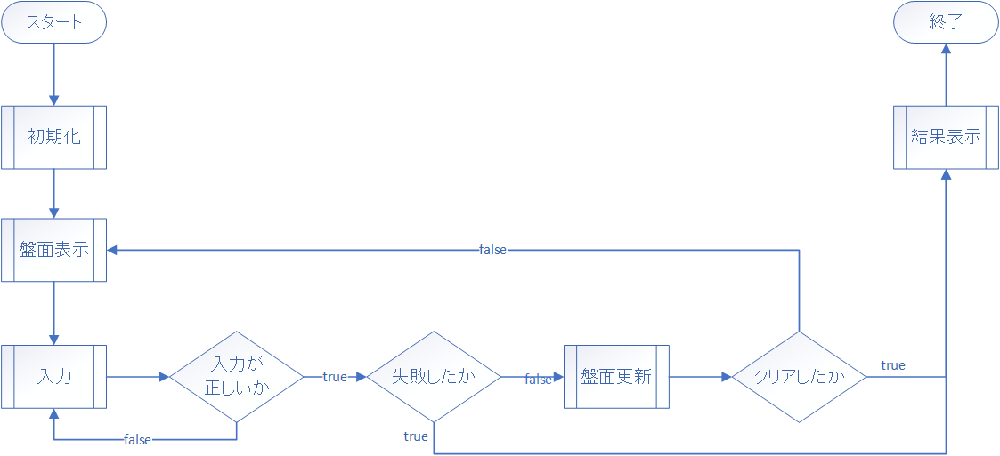
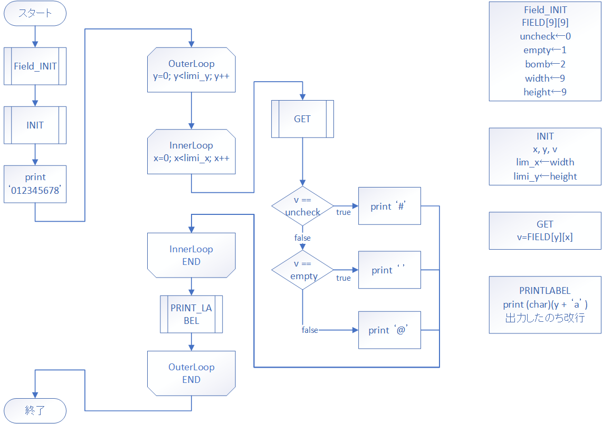
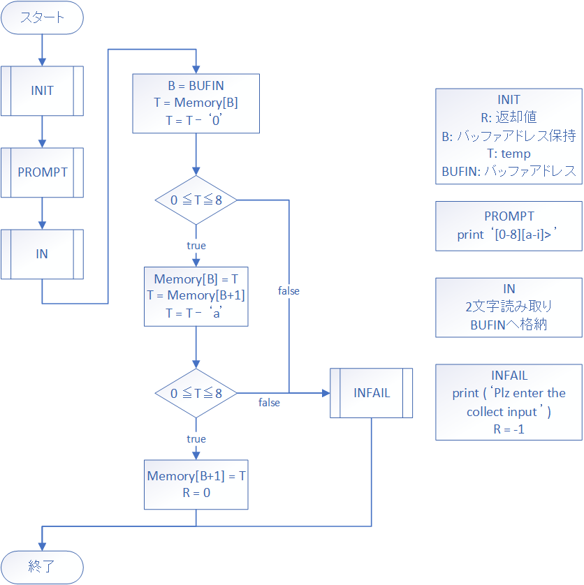

# 手を動かして学ぶ！コンピュータアーキテクチャとアセンブリ言語プログラミングの基本

## マインスイーパを作ろう（要件定義前編）

前回はちょっと実用的なものということで計算機を作ってみました。計算機を作ることで単純にコンピュータ上に計算機を実装する方法論だけではなく、プログラミング言語はどうやって演算の順番を制御しているんだろうとかコンパイラってそういうことなのねとか色々考えを巡らせている人もいるかもしれません。
今回はマインスイーパを作っていきたいと思います。マインスイーパというのは、盤面上に隠された爆弾を避け安全な所を探すゲームですが、実装することを考えたとき例えば乱数や二次元配列など基本になる要素を多く含んでおりゲーム自体はシンプルながら色々考えることがあり、計算機の実装とはまた違った思考を巡らせることになると思います。

それでは、よろしくお願いいたします。

### マインスイーパの要件定義

まずはマインスイーパのゲームの流れを確認してみましょう。



今回は簡単にするために、盤面は9x9でフラグ機能の実装はしないことにします。

それではマインスイーパの要件定義をしていきましょう。

- マインスイーパとは四角形で格子状に分割された盤面で行う安全な所を探し開けていくゲームである
- 盤面を表現するために二次元配列のようなデータ構造を実装する
- 初期化時に爆弾をランダムに設置するために乱数を実装する
- 盤面更新時に隣り合った爆弾じゃないマスを開ける処理のために探索を実装する
- 盤面を見やすく表示する機能を実装する
- 入力されたものが正しいかどうかの検査を実装する
- ゲームの最後に結果を表示する

結構細かく書き出してみましたが、その分ボリューミーに見えますね。でも大丈夫、要件定義編は前編中編後編とわけてじっくり考えるので問題ないです。

それでは始めに二次元配列からです。

### 二次元配列を考える

配列の実装はやりましたが、多次元配列についてはやっていませんね。前提としてですがメモリは一本しかなく本当の意味で多次元に扱うことが出来るわけではありません。なので一次元というか一本の線を区切って何本かの線に見立てることでやることになります。まずは考え方の解説をしますね。

こんな配列を想定します。

|y\x|0|1|2|
|::|:-:|:-:|:-:|
| 0|'a'|'b'|'c'|
| 1|'d'|'e'|'f'|
| 2|'g'|'h'|'i'|
| 3|'j'|'k'|'l'|


C言語で表現するとこんな感じでしょうか。

```C
char a[4][3] = {
    {'a', 'b', 'c'},
    {'d', 'e', 'f'},
    {'g', 'h', 'i'},
    {'j', 'k', 'l'},
};
```

このchar型の二次元配列はどのようにメモリに入っているでしょうか。

まず先ほど言った多次元配列は一次元のメモリを区切っているという考え方からすると、上のデータは実際にメモリにはこのように入っているはずです。

|アドレス|要素|
|:---:|:-:|
|0|'a'|
|1|'b'|
|2|'c'|
|3|'d'|
|4|'e'|
|5|'f'|
|6|'g'|
|7|'h'|
|8|'i'|
|9|'j'|
|10|'k'|
|11|'l'|

```
a[0][0]から相対位置のアドレスを表示しています。
```

さて実際にはメモリにこのように置かれている配列に対して、二つの数が与えられたときどのようにすればよいでしょうか。

`'h'`を取得する場合を考えます。`'h'`は`x`が`1`、`y`が`2`ですね。実アドレスでは`7`です。

まずは`y`をそれぞれの行に対応させる方法ですが、`y`に`x`の要素数を掛け算すれば良さそうですね。この場合は`y`は`2`、`x`の要素数は`3`なので`6`、実アドレスでは`'g'`を指すことが出来ました。

次に`x`についてですが、これは先ほどの計算したものに`x`の値を単純に足せば出来そうですね。取得のための関数だけではなく格納の為の関数も実装すると以下のようになります。

```C
#define X_LEN 3
#define Y_LEN 4

char a[12] = {
    'a', 'b', 'c',
    'd', 'e', 'f',
    'g', 'h', 'i',
    'j', 'k', 'l',
};

char get(int x, int y){
    return a[y * X_LEN + x];
}

void set(int x, int y, char c){
    a[y * X_LEN + x] = c;
}
```

つまり、二次元配列を実装するためには、二つの添え字`x, y`と片方の配列の要素の数`xの長さ`と専用の取得・格納の為の関数が必要ということになります。

これをMLFEにて実装していきましょう。

まず、配列と要素の個数を定義します。

```
PGM     START
        RET

X_LEN   DC      3
Y_LEN   DC      4               ; 使わない
ARRAY   DC      'abcdefghijkl'

        END

```

今回取得する場所を指定する添え字を作ります。ついでに関数呼び出しと出力もやっときましょう。

```
PGM     START
        LAD     GR1, 1      ; x
        LAD     GR2, 2      ; y
        
        LAD     GR3, 0      ; stdout_char
        
        CALL    GET
        WRITE   GR3, GR0
        RET

; 省略
        END
```

`GET`関数について考えます。`GET`関数でやるべきなのは以下の手順です。

1. レジスタの退避を行う
2. 引数`y`（GR2）に`xの要素数`（X_LEN）を乗算する
3. 計算した結果を`x`（GR1）に加算する
4. `x`（GR1）と`ARRAY`のアドレスで指標アドレッシングを行う
5. 取得した値を返却値（GR0）に入れる
6. レジスタ回復を行う

これをプログラムに起こすとこのようになります。

```
GET     RPUSH   1, 2
        MULA    GR2, X_LEN
        ADDA    GR1, GR2
        LD      GR0, ARRAY, GR1
        RPOP    1, 2
        RET
```

`SET`関数も実装しますか。

```
PGM     START
        LAD     GR1, 1
        LAD     GR2, 2
        LAD     GR3, 0
        
        CALL    GET         ; h
        WRITE   GR3, GR0
        
        LAD     GR3, 'x'
        CALL    SET
        CALL    GET         ; x
        
        LAD     GR3, 0
        WRITE   GR3, GR0
        
        RET
        
; GET   省略
        
SET     NOP
        
; 省略
        END
```

1. レジスタの退避を行う
2. 引数`y`（GR2）に`xの要素数`（X_LEN）を乗算する
3. 計算した結果を`x`（GR1）に加算する
4. `x`（GR1）と`ARRAY`のアドレスで指標アドレッシングを行う
5. 格納する値（GR3）をそのアドレスへ入れる
6. レジスタ回復を行う

```
SET     RPUSH   1, 2
        MULA    GR2, X_LEN
        ADDA    GR1, GR2
        ST      GR3, ARRAY, GR1
        RPOP    1, 2
        RET
```

`arytest.fe`という名前で保存してみました。実行します。

```
> python mlfe.py arytest.fe
hx
```

良さそうですね。これで二次元配列は大丈夫でしょう。  
興味がある方は任意の次元の配列をどうすればよいか考えてみてください。

### 盤面を表示する

二次元配列をやった次にはそれを盤面として表示する方法について考えてみます。機能が足りないので完全にはできないのですが、現状できるところまでやってみましょう。

二次元配列を盤面の用に表示するとして考えられる方法の一つに、二重ループを用いて行と列を表示していく方法があります。それを実装していきたいと思います。

始めにシンプルな二重ループについて実装してみましょう。C言語でいうならこんな感じ。

```C
void double_loop(){
    int x, y, lim_x = 9, lim_y = 9;
    for(y = 0; y < lim_y; y++){
        printf("Y=%d\n", y);
        for(x = 0; x < lim_x; x++){
            printf(" X=%d", x);
        }
        printf("\n");
    }
}
```

まずはただの`FOR`ループ構造を書きます。`FizzBuzzを作ろう`の要件定義の所で出たものをほとんどそのままです。

```
PGM     START
FORINIT LD      GR1, ZERO       ; counter
        LD      GR2, LOOPLIM    ; loop_limit
        LD      GR3, STDOUTD    ; stdout_decimal
        
        
        CPA     GR1, GR2        ; if counter<loop_limit
        JMI     FORLP           ;       -> FORLP
        JUMP    FOREND          ; else  -> FOREND
        
FOR     ADDA    GR1, =1         ; counter += 1
        
        CPA     GR1, GR2        ; if counter<loop_limit
        JMI     FORLP           ;       -> FORLP
        JUMP    FOREND          ; else  -> FOREND
        
FORLP   WRITE   GR3, GR1        ; print counter
        OUT     ='\n', =1       ; print line feed
        
        JUMP    FOR
FOREND  RET

LOOPLIM DC      10

ZERO    DC      0
STDOUTD DC      1
        END
```

多重ループにするために必要な値の宣言と、すでにある`FOR`ループは外側のループになるのでラベルの名前を変えてみます。

```
PGM     START
; OUT FOR Init
OUTFORI LAD     GR1, 0          ; x
        LAD     GR2, 0          ; y
        LD      GR3, WIDTH      ; limit_x
        LD      GR4, HEIGHT     ; limit_y
        
        LAD     GR5, 1          ; stdout_decimal
        LAD     GR6, 0          ; stdout_char
        LAD     GR7, '\n'       ; line feed
        
        CPA     GR2, GR4        ; if counter<loop_limit
        JMI     OUTFORL         ;       -> OUTFORL
        JUMP    OUTFORE         ; else  -> OUTFORE
; OUT FOR
OUTFOR  ADDA    GR2, =1         ; counter += 1
        
        CPA     GR2, GR4        ; if counter<loop_limit
        JMI     OUTFORL         ;       -> OUTFORL
        JUMP    OUTFORE         ; else  -> OUTFORE
; OUT FOR Loop
OUTFORL OUT     ='Y=', =2
        WRITE   GR5, GR2
        WRITE   GR6, GR7
        
        JUMP    OUTFOR
; OUT FOR End
OUTFORE RET

WIDTH   DC      9
HEIGHT  DC      9
        END
```

```
Y=0
Y=1
Y=2
Y=3
Y=4
Y=5
Y=6
Y=7
Y=8
```


二重ループにするためには`OUTFORL`の中にまたループ構造を入れます。

```
PGM     START
; OUTFORI 省略
; OUTFORI 省略
        
OUTFORL OUT     ='Y=', =2
        WRITE   GR5, GR2
        WRITE   GR6, GR7
        
        
; INner FOR Init
INFORI  LAD     GR1, 0
        
        CPA     GR1, GR3
        JMI     INFORL
        JUMP    INFORE
; INner FOR
INFOR   ADDA    GR1, =1
        
        CPA     GR1, GR3
        JMI     INFORL
        JUMP    INFORE
; INner FOR Loop
INFORL  OUT     =' X=', =3
        WRITE   GR5, GR1
        
        JUMP    INFOR
;INner FOR End
INFORE  WRITE   GR6, GR7
        
        JUMP    OUTFOR
OUTFORE RET

; WIDTH HEIGHT 省略
        END
```

```
Y=0
 X=0 X=1 X=2 X=3 X=4 X=5 X=6 X=7 X=8
Y=1
 X=0 X=1 X=2 X=3 X=4 X=5 X=6 X=7 X=8
Y=2
 X=0 X=1 X=2 X=3 X=4 X=5 X=6 X=7 X=8
Y=3
 X=0 X=1 X=2 X=3 X=4 X=5 X=6 X=7 X=8
Y=4
 X=0 X=1 X=2 X=3 X=4 X=5 X=6 X=7 X=8
Y=5
 X=0 X=1 X=2 X=3 X=4 X=5 X=6 X=7 X=8
Y=6
 X=0 X=1 X=2 X=3 X=4 X=5 X=6 X=7 X=8
Y=7
 X=0 X=1 X=2 X=3 X=4 X=5 X=6 X=7 X=8
Y=8
 X=0 X=1 X=2 X=3 X=4 X=5 X=6 X=7 X=8
```

これを関数化します。

```
PGM     START
        CALL    DLOOP
        RET

; OUTFORIから関数名DLOOPに変更
; Double LOOP
DLOOP   RPUSH   1, 7
        
        LAD     GR1, 0          ; x
        LAD     GR2, 0          ; y
        LD      GR3, WIDTH      ; limit_x
        LD      GR4, HEIGHT     ; limit_y
        
        LAD     GR5, 1,         ; stdout_decimal
        
        LAD     GR6, 0          ; stdout_char
        LAD     GR7, '\n'       ; linefeed
        
        
        CPA     GR2, GR4
        JMI     OUTFORL
        JUMP    OUTFORE
; OUTFOR  省略
; OUTFORL 省略
; INFOR   省略
; INFORL  省略
; INFORE  省略
OUTFORE RPOP   1, 7
        RET

WIDTH   DC      9
HEIGHT  DC      9

        END
```

二重ループができましたね。これを活用して盤面の描写をしてみましょう。
盤面のイメージはこんな感じです。

```
012345678
   1#####a
   1#####b
   13####c
    2####d
  113#3##e
111######f
####2#2##g
#########h
#########i
```

盤面の状態を保持する配列`FIELD`があるとします。`FIELD`の要素数は81で、9x9の二次元配列で盤面の情報を持っています。

それぞれのマスには`未確認`・`空`・`爆弾`の状態があります。

盤面表示関数はそれぞれの数値に合わせて文字を表示します。

- 未確認は`'#'`
- 空は`' '(スペース)`、周辺に爆弾がある時はその数
- 爆弾は`'@'`、未発見時には`'#'`

また、盤面の表示の端にアルファベットと数字を表示して入力のためのガイドとして使う

大体以上です。周辺に爆弾があるときの処理や未発見時の爆弾の表示は後回しにして、ただ現在の盤面の情報を参照して文字を出力するものを実装してみます。



まずは`Field_INIT`からです。`Field_INIT`に関してはフローチャート上で未定義な変数を作らないためのものなので関数内の処理ではありません。

```
PGM     START
        CALL    SHOWF
        RET

SHOWF   RET

WIDTH   DC      9
HEIGHT  DC      9
FIELD   DS      81

UNCHK   DC      0
EMPTY   DC      1
BOMB    DC      2
CUNCHK  DC      '#'
CEMPTY  DC      ' '
CBOMB   DC      '@'

        END
```

次に`INIT`です。レジスタは7つ使います。

```
; PGM 省略

; SHOW Field
SHOWF   RPUSH   1, 7
        LAD     GR1, 0          ; x
        LAD     GR2, 0          ; y
        LD      GR3, WIDTH      ; limit_x
        LD      GR4, HEIGHT     ; limit_y
        LAD     GR5, 0          ; z
        
        LAD     GR6, 0          ; stdout_char
        LAD     GR7, '\n'       ; line feed
        
        
        RPOP    1, 7
        RET

; 諸変数　省略
```

`01234568`と出力します。盤上上側の数字ラベルですね。

```
　       OUT     ='012345678\n', =10
```

二重ループを実装します。先ほど書いたものをほとんどそのまま記述します。`Y=`と出力するところと`X=`と出力するところは削ります。

```
SHOWF   RPUSH   1, 7
        LAD     GR1, 0          ; x
        LAD     GR2, 0          ; y
        LD      GR3, WIDTH      ; limit_x
        LD      GR4, HEIGHT     ; limit_y
        LAD     GR5, 0          ; z
        
        LAD     GR6, 0          ; stdout_char
        LAD     GR7, '\n'       ; line feed
        
        
        OUT     ='012345678\n', =10
        
        CPA     GR2, GR4
        JMI     OUTFORL
        JUMP    OUTFORE
OUTFOR  ADDA    GR2, =1
        CPA     GR2, GR4
        JMI     OUTFORL
        JUMP    OUTFORE
OUTFORL LAD     GR1, 0          ; 'Y='と書いてあるところを消す
        
        CPA     GR1, GR3
        JMI     INFORL
        JUMP    INFORE
INFOR   ADDA    GR1, =1
        
        CPA     GR1, GR3
        JMI     INFORL
        JUMP    INFORE
INFORL  NOP                     ; 'X='と書いてあるところを消す
        JUMP    INFOR
INFORE  WRITE   GR6, GR7
        
        JUMP    OUTFOR
OUTFORE JUMP    SHOWFE
        
SHOWFE  RPOP    1, 7
        RET
```

`GET`関数を書きます。

```
GET     RPUSH   1, 2
        MULA    GR2, WIDTH
        ADDA    GR1, GR2
        LD      GR0, FIELD, GR1
        RPOP    1, 2
        RET
```

きちんと機能するか確認しましょう。

```
INFORL  CALL    GET
        LAD     GR8, 1
        WRITE   GR8, GR0
        JUMP    INFOR
```

```
012345678
000000000
000000000
000000000
000000000
000000000
000000000
000000000
000000000
000000000
```

0が大量に並びましたが、こうなればOKです。条件分岐部分を記述していきましょう。

```
INFORL  CALL    GET
        LD      GR5, GR0

        CPA     GR5, UNCHK
        JNZ     NTUNCK
        LD      GR5, CUNCHK
        JUMP    INFORLE
; NoT UNCheCK
NTUNCK  CPA     GR5, EMPTY
        JNZ     NTEMPTY
        LD      GR5, CEMPTY
        JUMP    INFORLE
; NoT EMPTY
NTEMPTY LD      GR5, CBOMB
        JUMP    INFORLE
; INner FOR Loop Else
INFORLE WRITE   GR6, GR5
        JUMP    INFOR
```

```
012345678
#########
#########
#########
#########
#########
#########
#########
#########
#########
```

大分イメージに近づいてきましたね、盤面表示が上手くいっているか確かめるためにダミーの情報を埋め込んで動作するか試してみましょう。`SET`関数を実装します。

```
SET     RPUSH   1, 2
        MULA    GR2, WIDTH
        ADDA    GR1, GR2
        ST      GR3, FIELD, GR1
        RPOP    1, 2
        RET
```

```
PGM     START
        LAD     GR1, 3
        LAD     GR2, 3
        LD      GR3, EMPTY
        CALL    SET
        LAD     GR1, 6
        LAD     GR2, 7
        LD      GR3, BOMB
        CALL    SET
        CALL    SHOWF
        RET
```

```
012345678
#########
#########
#########
### #####
#########
#########
#########
######@##
#########
```

きちんとできてます。OKです。最後に右端に列を表すアルファベットを出力させましょう。

やり方としては、内側ループの終端である`INFORE`の改行の前にアルファベットを出力する感じです。

```
INFORE  LD      GR5, GR2        ; v = y
        ADDA    GR5, ='a'       ; v = v + 'a'
        WRITE   GR6, GR5        ; print char v
        
        WRITE   GR6, GR7
        
        JUMP    OUTFOR
```

それぞれの行番号について`y`が保持しているわけですが、`v`にそれをコピーして、`'a'`である`97`を足すことでそれぞれの行のアルファベットを出力する、という感じです。

```
012345678
#########a
#########b
#########c
### #####d
#########e
#########f
#########g
######@##h
#########i
```

これでひとまずは完成です。長かったですね。

### 入力を受け取る

盤面表示関数の次には、正しく入力を受け取る関数の実装に行きたいと思います。入力関数の仕事は、

- 適切な入力プロンプトを出力する
- 2文字分取得し専用のバッファにいれる
- バッファの中身が正しいか調べる
- 正しかったらバッファの中身を数値に変換し呼び出しもとに成功した旨を伝える
- 誤っていたら正しい入力をしてくださいと出力し、呼び出しもとにエラーを伝える

正しい入力がされるまで何度も呼び出すのは呼び出しもとの責任で行うことにします。

フローチャートはこんな感じです。



さて`INIT`です。使うレジスタは3個です。`GR0`は返却値なのでレジスタ退避する必要はありません。

```
PGM     START
        CALL    INPUT
        RET

INPUT   RPUSH   1, 2
        LAD     GR0, 0      ; R
        LAD     GR1, 0      ; B
        LAD     GR2, 0      ; T
        
        RPOP    1, 2
        RET

BUFIN   DS      2

        END
```

次に`PROMPT`です。これは出力するだけなので簡単です。

```
INPUT   RPUSH   1, 2
        LAD     GR0, 0      ; R
        LAD     GR1, 0      ; B
        LAD     GR2, 0      ; T
        
        OUT     ='[0-8][a-i]> ', =12
        
        RPOP    1, 2
        RET
```

次に`IN`です。標準マクロ命令の`IN`を使いたいと思います。

```
        OUT     ='[0-8][a-i]> ', =12
        
        IN      BUFIN, =2
```

`B`に`BUFIN`のアドレスを保持して、それを経由してアクセスしたバッファの1文字目を`T`に格納、`'0'`を引き算することで文字の`0`から数値の`0`に変換します。

```
        OUT     ='[0-8][a-i]> ', =12
        
        IN      BUFIN, =2
        
        LAD     GR1, BUFIN
        LD      GR2, 0, GR1
        SUBA    GR2, ='0'
```

`T`が範囲内、つまり0から8に収まっているかを確認します。これは2文字目にも同じ処理をするので関数化しておきます。

```
; ISINField
ISINF   PUSH    0, GR1
        LAD     GR1, 0
        CPA     GR2, GR1
        JMI     ISINFFL
        LAD     GR1, 8
        CPA     GR2, GR1
        JPL     ISINFFL
        LAD     GR0, 0
        POP     GR1
        RET
ISINFFL LAD     GR0, -1
        POP     GR1
        RET
```

失敗したときの処理を先に書いちゃいます。

```
INPUT   RPUSH   1, 2
        LAD     GR0, 0      ; R
        LAD     GR1, 0      ; B
        LAD     GR2, 0      ; T
        
        OUT     ='[0-8][a-i]> ', =12
        
        IN      BUFIN, =2
        
        LAD     GR1, BUFIN
        LD      GR2, 0, GR1
        SUBA    GR2, ='0'
        
        CALL    ISINF
        
        CPA     GR0, ZERO
        JNZ     INFAIL
        
        
        
        RPOP    1, 2
        RET

INFAIL  OUT     ='Plz enter the collect input ', =28
        LAD     GR0, -1
        RPOP    1, 2
        RET
```

`T`に入っている正しい数値を`BUFIN`の1文字目に格納しつつ、2文字目を取得して、それから`'a'`を引き算する。


```
        CALL    ISINF
        
        CPA     GR0, ZERO
        JNZ     INFAIL
        
        ST      GR2, 0, GR1
        LD      GR2, 1, GR1
        SUBA    GR2, ='a'
        
        RPOP    1, 2
        RET
```

`ISINF`を呼び出し、数値が正しいか検証する。

```
        ST      GR2, 0, GR1
        LD      GR2, 1, GR1
        SUBA    GR2, ='a'
        
        CALL    ISINF
        CPA     GR0, ZERO
        JNZ     INFAIL
        
        
        RPOP    1, 2
        RET
```

正しい数値の`T`を`BUFIN`の2文字目に格納して、呼び出しもとに帰る。

```
        CALL    ISINF
        CPA     GR0, ZERO
        JNZ     INFAIL
        
        ST      GR2, 1, GR1
        
        RPOP    1, 2
        RET
```

`INPUT`の実装できました。呼び出し側のループを実装します。

```
PGM     START
LOOP    CALL    INPUT
        CPA     GR0, ZERO
        JNZ     LOOP
        OUT     BUFIN, =2, =1
        RET
```

`OUT`の第三オペランドですが、フォーマットを指定出来ます。1は10進数数値の出力です。詳しくはマニュアルをご覧ください。

`input.fe`で保存しました。それでは試してみます。

```
> python mlfe.py input.fe
[0-8][a-i]> 54
Plz enter the collect input [0-8][a-i]> ia
Plz enter the collect input [0-8][a-i]> a6
Plz enter the collect input [0-8][a-i]> 0d
03
```

最初に`54`と入力しました。これは不正な入力です。次に`ia`、`a6`と入力しますがこれも不正です。最後に`0d`と入力しました。これは正しいのでループを外れて結果を出力します。

これで`INPUT`の実装ができましたね。お疲れさまでした。

## まとめ

- 二次元配列は専用の取得関数、格納関数を定義することで実装することが出来る
- 二重ループくらいなら実装は簡単
- 正しい入力を促すために適切なプロンプトを出力しよう
- `OUT`マクロはフォーマット指定もできる

