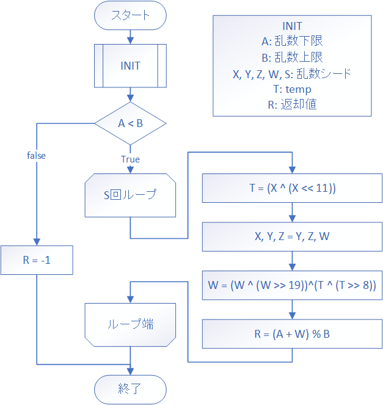
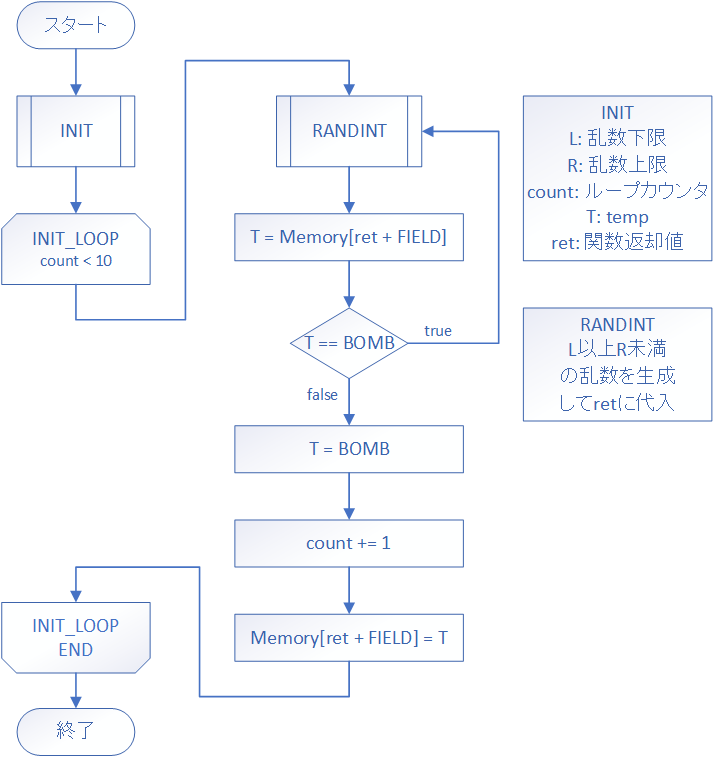

# 手を動かして学ぶ！コンピュータアーキテクチャとアセンブリ言語プログラミングの基本

## マインスイーパを作ろう（要件定義中編）

引き続きマインスイーパの要件定義についてやっていきたいと思います。前回は二次元配列、盤面の表示、入力についてやりました。今回は爆弾をランダムに置くのに必要な乱数の実装についてやっていこうと思います。

### 乱数の実装

それでは始めに乱数の実装についてやっていきたいと思います。まず皆さんは機械には乱数の出力はできないというのはご存じでしょうか。乱数の生成と言うと例えばサイコロを振るとかコイントスと行うとか考えられますが、少し考えるとそれの再現というのは困難なことがわかると思います。

機械には乱数の生成ができないと言っても、現実的には乱数生成というのは多くの場所で用いられています、機械に生成させた乱数っぽいもののことを疑似乱数と言い、コンピュータゲームとかで使われるような乱数というのはその疑似乱数を用いてやるわけです。

というわけで疑似乱数の生成を実装していきます。疑似乱数生成のアルゴリズムはいくつも開発されていますが、今回用いるのは`Xorshift`アルゴリズムです。このアルゴリズムの特徴は乱数のシードとなる値を4つと排他的論理和とシフト演算ができれば実装が出来てしまう、軽量ながら精度の高い乱数の生成ができるアルゴリズムです。完全な理解は難しいので詳細は元の論文[Xorshift RNGs](https://www.jstatsoft.org/article/view/v008i14)に任せますが、これを用いればMLFEでも良い乱数が生成できちゃうんです。

それでは実装をしていきます。



乱数生成なのにループをしています。これは、乱数生成というものは乱数列と呼ばれる疑似乱数の数列を生成することなんですが、今回欲しいのはその一つだけなので、変数`S`回分だけループを回してその先端の数値を乱数として取り出そうという試みなわけです。なのでこの実装においてはシードとなる値は4+1ということになりますね。

`INIT`を見ていきます。`INIT`では生成乱数の幅を表す`A`と`B`、シード値である`X`・`Y`・`Z`・`W`・`S`、計算の時に使う`T`、返却値の`R`を定義しています。シード値として現在時刻を使っていますね。`SVC`命令の`time`をつかって取得します。

```
        SVC     time
        ; GR0 <- 処理の可否（成功なら0）
        ; GR1 <- ミリ秒
        ; GR2 <- 秒
        ; GR3 <- 分
        ; GR4 <- 時間
        ; GR5 <- 日
        ; GR6 <- 月
        ; GR7 <- 年
```


```
PGM     START
        CALL    RAND
        RET

RAND    LAD     GR1, 0
        LAD     GR2, 100
        
INIT    RPUSH   1, 7
        
        PUSH    0, GR1
        PUSH    0, GR2
        SVC     time
        ST      GR2, S          ; S <- 秒
        MULA    GR6, GR1
        ST      GR6, X          ; X <- 月 * ミリ秒
        MULA    GR5, GR1
        ST      GR5, Y          ; Y <- 日 * ミリ秒
        MULA    GR4, GR1
        ST      GR4, Z          ; Z <- 時間 * ミリ秒
        MULA    GR3, GR1
        ST      GR3, W          ; W <- 分 * ミリ秒
        POP     GR2
        POP     GR1
        
        LAD     GR0, -1
        
        
        
        RPOP    1, 7
        RET

X       DC      0
Y       DC      0
Z       DC      0
W       DC      0
S       DC      0
ZERO    DC      0
ONE     DC      1
        END

```

条件分岐です。`A(GR1)`と`B(GR2)`を比較して、`A < B`な関係の時だけ次の処理に進むようにします。`A = B`や`A > B`の時は`RANDEND`に飛んでサブルーチンの処理を終わります。呼び出しもとは、エラーが起った時には`-1`を返します。

```
PGM     START
        CALL    RAND
        RET

RAND    LAD     GR1, 0
        LAD     GR2, 100
        
INIT    RPUSH   1, 7

        PUSH    0, GR1
        PUSH    0, GR2
        SVC     time
        ; 省略
        POP     GR2
        POP     GR1
        
        LAD     GR0, -1         ; R <- error
        
        
RANDEND RPOP    1, 7
        RET

; 変数　省略
        END
```

ループの実装をします。今回は`for`ループ的なループを回す中でループした回数を参照できるようなループ構造は必要ないので、もっとシンプルなループ構造を実装します。

`GR6`に`S`の値をロードして、ループ一回ごとに`GR6`の値を1減算します。`GR6`の値が`0`になったらループ終了という簡単なループです。

```
PGM     START
        CALL    RAND
        RET

RAND    LAD     GR1, 0
        LAD     GR2, 100
        
INIT    RPUSH   1, 7

        PUSH    0, GR1
        PUSH    0, GR2
        SVC     time
        ; 省略
        POP     GR2
        POP     GR1
        
        LAD     GR0, -1         ; R <- error
        
        CPA     GR2, GR1
        JMI     RANDEND
        
        LD      GR6, S
        
RANDLP  CPA     GR6, ZERO
        JZE     RANDEND
        
        
        
        SUBA    GR6, ONE
        JUMP    RANDLP
        
RANDEND RPOP    1, 7
        RET

; 変数　省略
        END
```

ループ内の計算部分に入ります。まずは`T`に`X`と`X`を左シフトしたものを排他的論理和を取ったものをいれる処理です。

```
; PGM 省略
; RAND 省略
; INIT 省略
        
RANDLP  CPA     GR6, ZERO
        JZE     RANDEND
        
        LD      GR3, X          ; T = (X ^ (X << 11))
        SLL     GR3, 11
        XOR     GR3, X
        
        SUBA    GR6, ONE
        JUMP    RANDLP
        
RANDEND RPOP    1, 7
        RET

; 変数　省略
        END
```

次に変数を回転させます。

```
; PGM 省略
; RAND 省略
; INIT 省略
        
RANDLP  CPA     GR6, ZERO
        JZE     RANDEND
        
        LD      GR3, X          ; T = (X ^ (X << 11))
        SLL     GR3, 11
        XOR     GR3, X
        
        LD      GR4, Y          ; X <- Y
        ST      GR4, X
        LD      GR4, Z          ; Y <- Z
        ST      GR4, Y
        LD      GR4, W          ; Z <- W
        ST      GR4, Z
        
        SUBA    GR6, ONE
        JUMP    RANDLP
        
RANDEND RPOP    1, 7
        RET

; 変数　省略
        END
```

次に`W=(W^(W>>19))^(T^(T>>8))`の所です。とりあえず左側`(W ^ (W >> 19))`から、`GR4`に`W`の値がコピーされているのでそれを使います。

```
; PGM 省略
; RAND 省略
; INIT 省略
        
RANDLP  CPA     GR6, ZERO
        JZE     RANDEND
        
        LD      GR3, X          ; T = (X ^ (X << 11))
        SLL     GR3, 11
        XOR     GR3, X
        
        LD      GR4, Y          ; X <- Y
        ST      GR4, X
        LD      GR4, Z          ; Y <- Z
        ST      GR4, Y
        LD      GR4, W          ; Z <- W
        ST      GR4, Z
        
        SRL     GR4, 19         ; W ^ (W >> 19)
        XOR     GR4, W
        
        SUBA    GR6, ONE
        JUMP    RANDLP
        
RANDEND RPOP    1, 7
        RET

; 変数　省略
        END
```

次に右側`T ^ (T >> 8)`の部分です。`GR3`に`T`の値が入っているのでそれを`GR5`へコピー、コピーしたものへ右シフト、`T(GR3)`と右シフトしてもので排他的論理和を取ります。

```
; PGM 省略
; RAND 省略
; INIT 省略
        
RANDLP  CPA     GR6, ZERO
        JZE     RANDEND
        
        LD      GR3, X          ; T = (X ^ (X << 11))
        SLL     GR3, 11
        XOR     GR3, X
        
        LD      GR4, Y          ; X <- Y
        ST      GR4, X
        LD      GR4, Z          ; Y <- Z
        ST      GR4, Y
        LD      GR4, W          ; Z <- W
        ST      GR4, Z
        
        SRL     GR4, 19         ; W ^ (W >> 19)
        XOR     GR4, W
        
        LD      GR5, GR3        ; T ^ (T >> 8)
        SRL     GR5, 8
        XOR     GR3, GR5
        
        SUBA    GR6, ONE
        JUMP    RANDLP
        
RANDEND RPOP    1, 7
        RET

; 変数　省略
        END
```

次に上二つの計算結果の値を排他的論理和、それぞれ`GR4`と`GR3`に入っています。

```
; PGM 省略
; RAND 省略
; INIT 省略
        
RANDLP  CPA     GR6, ZERO
        JZE     RANDEND
        
        LD      GR3, X          ; T = (X ^ (X << 11))
        SLL     GR3, 11
        XOR     GR3, X
        
        LD      GR4, Y          ; X <- Y
        ST      GR4, X
        LD      GR4, Z          ; Y <- Z
        ST      GR4, Y
        LD      GR4, W          ; Z <- W
        ST      GR4, Z
        
        SRL     GR4, 19         ; W = W ^ (W >> 19)
        XOR     GR4, W
        
        LD      GR5, GR3        ; T = T ^ (T >> 8)
        SRL     GR5, 8
        XOR     GR3, GR5
        
        XOR     GR4, GR3        ; W = W ^ T
        
        SUBA    GR6, ONE
        JUMP    RANDLP
        
        
RANDEND RPOP    1, 7
        RET

; 変数　省略
        END
```

乱数の先端が`W(GR4)`に入っているので`A(GR1)`と`B(GR2)`の値で範囲調整して、返却値に代入します。都度これを計算することはあんまり良いプログラムじゃ無いかもしれませんが、ループの出口が`RANDLP`の先頭部分だけになるのでみやすいプログラムになったのではないでしょうか。

```
; PGM 省略
; RAND 省略
; INIT 省略
        
RANDLP  CPA     GR6, ZERO
        JZE     RANDEND
        
        LD      GR3, X          ; T = (X ^ (X << 11))
        SLL     GR3, 11
        XOR     GR3, X
        
        LD      GR4, Y          ; X <- Y
        ST      GR4, X
        LD      GR4, Z          ; Y <- Z
        ST      GR4, Y
        LD      GR4, W          ; Z <- W
        ST      GR4, Z
        
        SRL     GR4, 19         ; W = W ^ (W >> 19)
        XOR     GR4, W
        
        LD      GR5, GR3        ; T = T ^ (T >> 8)
        SRL     GR5, 8
        XOR     GR3, GR5
        
        XOR     GR4, GR3        ; W = W ^ T
        
        ADDA    GR4, GR1        ; R = (A + W) % B
        DIVA    GR5, GR4, GR2
        MULA    GR5, GR2
        SUBA    GR0, GR4, GR5
        
        SUBA    GR6, ONE
        JUMP    RANDLP
        
        
        SUBA    GR6, ONE
        JUMP    RANDLP
        
RANDEND RPOP    1, 7
        RET

; 変数　省略
        END
```

乱数の実装は出来ました。呼び出しもとで生成した数値を出力する処理を書きます。

```
PGM     START
        CALL    RAND
        LAD     GR1, 1
        WRITE   GR1, GR0
        RET
```

これで乱数の実装ができました。試しに実行してみましょう。

`xorshift.fe`で保存しました。実行してみます。

```
> python mlfe.py xorshift.fe
65
> python mlfe.py xorshift.fe
5
> python mlfe.py xorshift.fe
20
> python mlfe.py xorshift.fe
87
> python mlfe.py xorshift.fe
58
> python mlfe.py xorshift.fe
12
> python mlfe.py xorshift.fe
29
```

もちろん乱数なので上の通りの結果にはなりませんが、数字が良い感じにばらけています。これなら十分マインスイーパには使えそうですね。

ちなみに、標準マクロ命令には`RANDINT`というものがあります。

```
PGM     START
        LAD     GR1, 0
        LAD     GR2, 100
        RANDINT                 ; GR1 <= GR0 < GR2
        ;RANDINT 0, 100         ; left <= GR0 < right
        LAD     GR1, 1
        WRITE   GR1, GR0
        RET
        END
```

先ほどの実装をマクロ命令にして簡単に実行できるようにしてあります。中身はあんな感じなんだなとなんとなく覚えつつ、実際に乱数を使うときはこれを使ってくださいね。オペランドの指定が無いときは`GR1`と`GR2`の値を参照して、オペランドで数値二つが指定された時はそこから生成します。

### 爆弾の配置をする

乱数が使えるようになりました。それでは、フィールドに爆弾の配置をしていきたいと思います。以下のフローチャートをご覧ください。



アルゴリズムはシンプルです。乱数の下限と上限と設定した後、乱数を生成し、フィールドの添え字に生成した乱数を入れてもし爆弾がすでに入っていたらやり直し、入っていなかったらカウンタを1加算してそこに爆弾をおく、カウンタが決まった爆弾の数になったらループを終了して呼び出しもとに帰るというものです。

前回フィールドは二次元配列として扱うと解説したのですが、爆弾を適当に置くような場面では乱数を2種類生成しなければいけない二次元配列として扱うよりも一次元配列として扱う方がシンプルで効率が良いです。配列の次元をごちゃごちゃにしないように気を付けてくださいね。

まずは`INIT`です。必要なレジスタは、乱数の上限と下限、ループカウンタ、フィールド要素保持、乱数保持の計5個です。

```
PGM     START
        CALL    INIT
        RET
INIT    RPUSH   0, 4
        LAD     GR0, 0          ; ret
        LAD     GR1, 0          ; L
        LD      GR2, WIDTH      ; R
        MULA    GR2, HEIGHT
        LAD     GR3, 0          ; count
        LAD     GR4, 0          ; temp
        
        
        
        RPOP    0, 4
        RET

WIDTH   DC      9
HEIGHT  DC      9

FIELD   DS      81
NBOMB   DC      10

UNCHK   DC      0
EMPTY   DC      1
BOMB    DC      2
CUNCHK  DC      '#'
CEMPTY  DC      ' '
CBOMB   DC      '@'

ONE     DC      1

        END
```

ループ構造です。特筆することもありませんね。

```
PGM     START
        CALL    INIT
        RET
INIT    RPUSH   0, 4
        LAD     GR0, 0          ; ret
        LAD     GR1, 0          ; L
        LD      GR2, WIDTH      ; R
        MULA    GR2, HEIGHT
        LAD     GR3, 0          ; count
        LAD     GR4, 0          ; temp
        
INITLP  CPA     GR3, NBOMB      ; if count == number of bombs
        JZE     INITED          ;     then goto INITED
        
        
        ADDA    GR3, ONE        ; count += 1
        JUMP    INITLP          ; continue
        
INITED  RPOP    0, 4
        RET

WIDTH   DC      9
HEIGHT  DC      9

FIELD   DS      81
NBOMB   DC      10

UNCHK   DC      0
EMPTY   DC      1
BOMB    DC      2
CUNCHK  DC      '#'
CEMPTY  DC      ' '
CBOMB   DC      '@'

ONE     DC      1
        END
```

`RANDINT`の実行をします。返却値は`GR0`に格納されています。

```
; PGM 省略
; INIT 省略

INITLP  CPA     GR3, NBOM
        JZE     INITED
        
        RANDINT                 ; L <= ret < R
        
        ADDA    GR3, ONE        ; count += 1
        JUMP    INITLP          ; continue

; INITED 省略
; 変数 省略
```

先ほどの乱数を添え字にして`GR4`に`FIELD[ret]`要素を格納し、それが爆弾かどうか検証します。

```
; PGM 省略
; INIT 省略

INITLP  CPA     GR3, NBOM
        JZE     INITED
        
        RANDINT                 ; L <= ret < R
        
        LD      GR4, FIELD, GR0 ; T = Memory[FIELD + ret]
        CPA     GR4, BOMB       ; if T == BOMB
        JZE     INITLP          ;     then goto INITLP
        
        ADDA    GR3, ONE        ; count += 1
        JUMP    INITLP          ; continue
        

; INITED 省略
; 変数 省略
```

`GR4`に`BOMB`を入れて、`FIELD[ret]`に`GR4(BOMB)`を入れます。

```
; PGM 省略
; INIT 省略

INITLP  CPA     GR3, NBOM
        JZE     INITED
        
        RANDINT                 ; L <= ret < R
        
        LD      GR4, FIELD, GR0 ; T = FIELD[ret]
        CPA     GR4, BOMB       ; if T == BOMB
        JZE     INITLP          ;     then goto INITLP
        
        LD      GR4, BOMB       ; T = BOMB
        ST      GR4, FIELD, GR0 ; FIELD[ret] = T
        
        ADDA    GR3, ONE        ; count += 1
        JUMP    INITLP          ; continue

; INITED 省略
; 変数 省略
```

カウンタに1加算してループの先頭にジャンプします。

```
; PGM 省略
; INIT 省略

INITLP  CPA     GR3, NBOM
        JZE     INITED
        
        RANDINT                 ; L <= ret < R
        
        LD      GR4, FIELD, GR0 ; T = FIELD[ret]
        CPA     GR4, BOMB       ; if T == BOMB
        JZE     INITLP          ;     then goto INITLP
        
        LD      GR4, BOMB       ; T = BOMB
        ST      GR4, FIELD, GR0 ; FIELD[ret] = T
        
        ADDA    GR3, ONE        ; count += 1
        
        JUMP    INITLP          ; continue

; INITED 省略
; 変数 省略
```

実装できましたね。前回やった盤面を表示する関数`SHOWF`も実装して爆弾がうまく置けているか確認してみましょう。`SHOWF`はサブルーチンの中とかでなければどこでも構いません。ソースコード下部の変数がきちんと足りているかも確認してね。

```
PGM     START
        CALL    INIT
        CALL    SHOWF
        RET

; INIT 省略
; INITLP 省略
; INITED 省略

SHOWF   RPUSH   1, 7
        LAD     GR1, 0          ; x
        LAD     GR2, 0          ; y
        LD      GR3, WIDTH      ; limit_x
        LD      GR4, HEIGHT     ; limit_y
        LAD     GR5, 0          ; v
        LAD     GR6, 0          ; stdout_char
        LAD     GR7, '\n'       ; line feed
        OUT     ='012345678\n', =10
        CPA     GR2, GR4
        JMI     OUTFORL
        JUMP    OUTFORE
OUTFOR  ADDA    GR2, =1
        CPA     GR2, GR4
        JMI     OUTFORL
        JUMP    OUTFORE
OUTFORL LAD     GR1, 0
        CPA     GR1, GR3
        JMI     INFORL
        JUMP    INFORE
INFOR   ADDA    GR1, =1
        CPA     GR1, GR3
        JMI     INFORL
        JUMP    INFORE
INFORL  CALL    GET
        LD      GR5, GR0
        CPA     GR5, UNCHK
        JNZ     NTUNCK
        LD      GR5, CUNCHK
        JUMP    INFORLE
NTUNCK  CPA     GR5, EMPTY
        JNZ     NTEMPTY
        LD      GR5, CEMPTY
        JUMP    INFORLE
NTEMPTY LD      GR5, CBOMB
        JUMP    INFORLE
INFORLE WRITE   GR6, GR5
        JUMP    INFOR
INFORE  LD      GR5, GR2
        ADDA    GR5, ='a'
        WRITE   GR6, GR5
        WRITE   GR6, GR7
        JUMP    OUTFOR
OUTFORE JUMP    SHOWFE
SHOWFE  RPOP    1, 7
        RET

; 変数省略

```

`initfield.fe`で保存しました。実行します。

```
> python mlfe.py initfield.fe
012345678
#########a
###@#####b
########@c
#####@##@d
####@####e
########@f
#########g
#@#@#####h
#@@######i
```

```
> python mlfe.py initfield.fe
012345678
########@a
########@b
#@#######c
#####@###d
#####@###e
#########f
@#@######g
########@h
#@####@##i
```

上手く実行されていますね。どんどん形になっていく感じが良いですね。

今回は乱数とそれを利用した爆弾配置をやってみました。やってみると意外と単純なのに動かすと機械的にやっているとは思えないですよね、それがマインスイーパを作るおもしろさかなと思います。次回は盤面更新処理についてやっていきます。お疲れさまでした。


## まとめ
- 乱数アルゴリズムには`Xorshift`というものがある
- MLFEには`Xorshift`アルゴリズムを元にした乱数生成マクロ命令`RANDINT`がある
- 配列を一次元として扱ったり二次元として扱ったりして効率の良いプログラムを記述する
