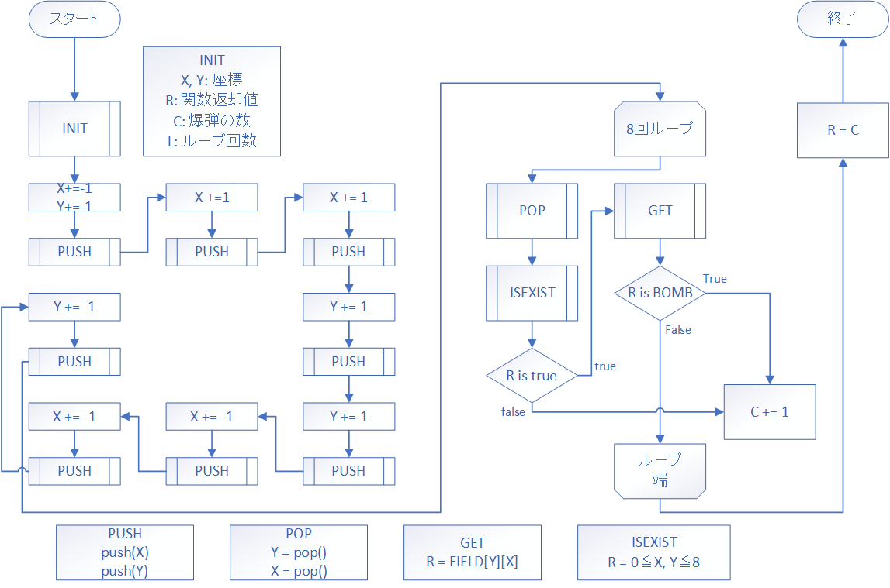
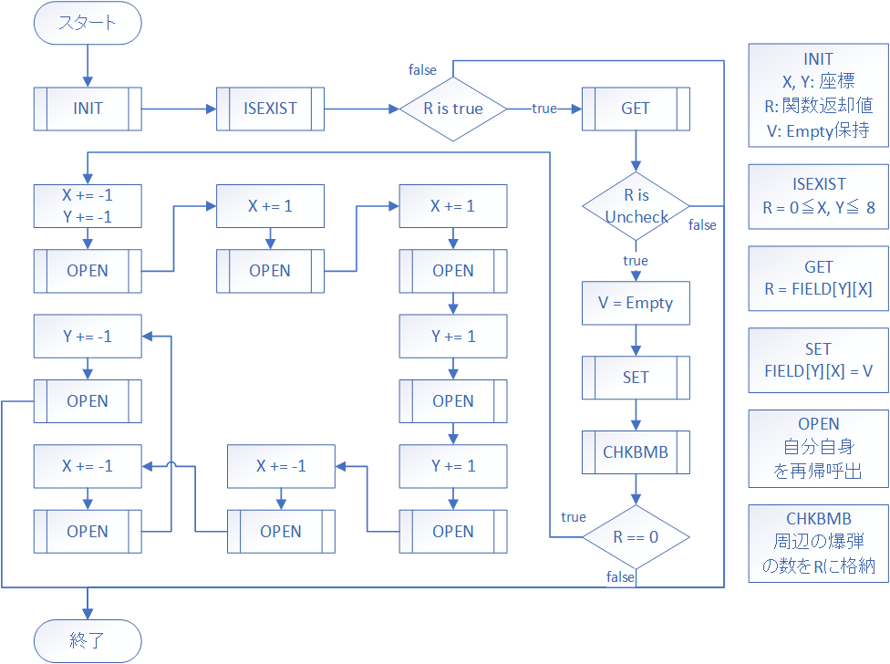

# 手を動かして学ぶ！コンピュータアーキテクチャとアセンブリ言語プログラミングの基本

## マインスイーパを作ろう（要件定義後編）

さて要件定義編も最後です。今回は盤面が空の場所を開けるための処理をやっていきたいと思います。要件定義前編の全体のフローチャートでやった`盤面更新`のあたりですね。それではいきましょう。

### 周辺の爆弾の数を取得する関数

爆弾の配置が前回出来るようになったので、次は指定した場所の周辺の爆弾の個数を取得できる関数を実装したいと思います。何に使うかと言いますと、空の場所を次々と開ける処理の中で終了条件の一つとして使ったり、盤面を表示する関数で使ったりします。結構重要です。



グルっと回っているところがありますが、これは周辺の爆弾を確認する時の場所をイメージしています。`INIT`をやってからすぐのところは左上を確認しているイメージです。

関数の`INIT`部と関数呼び出し部分です。過去実装した`INIT`、`SHOWF`、`INPUT`、`ISINF`、`GET`を使いますので書いておいてください、またそれらで使った変数も使いますのでそれも忘れずに。

```
PGM     START
        CALL    INIT
        CALL    SHOWF
        CALL    INPUT
        CALL    CHKBMB
        
        LAD     GR1, 1
        WRITE   GR1, GR0
        
        RET
        
; int ChecK BoMB(int x, int y) -> number of bomb
; GR0: R
; GR1: X
; GR2: Y
; GR3: C
; GR4: ループ回数
CHKBMB  RPUSH   1, 4
        LAD     GR0, 0
        LAD     GR3, 0
        LAD     GR4, 8
        
        
        
        RPOP    1, 4
        RET
        
; INIT  省略
; SHOWF 省略
; INPUT 省略
; ISINF 省略
; GET   省略

BUFIN   DS      2

WIDTH   DC      9
HEIGHT  DC      9

FIELD   DS      81
NBOMB   DC      10

UNCHK   DC      0
EMPTY   DC      1
BOMB    DC      2
CUNCHK  DC      '#'
CEMPTY  DC      ' '
CBOMB   DC      '@'

ONE     DC      1
ZERO    DC      0
        
        END
```

次に周辺の座標をスタックにプッシュしていきます。盤上にあるかどうかの検証はここでは行わず周辺をスタックに集めておいて、あとで全ての検証、確認を行います。フローチャートでは`PUSH`になっていますが、ようは`GR1`と`GR2`の値をスタックに入れられれば良いので`RPUSH`を使います。

```
; PGM   省略
        
; int ChecK BoMB(int x, int y) -> number of bomb
; GR0: R
; GR1: X
; GR2: Y
; GR3: C
; GR4: L
CHKBMB  RPUSH   1, 4
        LAD     GR0, 0
        LAD     GR3, 0
        LAD     GR4, 8
        
        SUBA    GR1, ONE    ; left up
        SUBA    GR2, ONE
        RPUSH   1, 2
        ADDA    GR1, ONE    ; up
        RPUSH   1, 2
        ADDA    GR1, ONE    ; right up
        RPUSH   1, 2
        ADDA    GR2, ONE    ; right
        RPUSH   1, 2
        ADDA    GR2, ONE    ; right down
        RPUSH   1, 2
        SUBA    GR1, ONE    ; down
        RPUSH   1, 2
        SUBA    GR1, ONE    ; left down
        RPUSH   1, 2
        SUBA    GR2, ONE    ; left
        RPUSH   1, 2
        
        
        
        RPOP    1, 4
        RET
        

        
; INIT  省略
; SHOWF 省略
; INPUT 省略
; ISINF 省略
; GET   省略
; 変数  省略
        
        END
```

ループを実装します。ループ回数は`GR4`に入れてあるので、ループ一回ごとに1引いて0になったら停止するループにしたいと思います。

```
; PGM   省略
        
; int ChecK BoMB(int x, int y) -> number of bomb
; GR0: R
; GR1: X
; GR2: Y
; GR3: C
; GR4: L
CHKBMB  RPUSH   1, 4
        LAD     GR0, 0
        LAD     GR3, 0
        LAD     GR4, 8
        
        SUBA    GR1, ONE    ; left up
        SUBA    GR2, ONE
        RPUSH   1, 2
        ADDA    GR1, ONE    ; up
        RPUSH   1, 2
        ADDA    GR1, ONE    ; right up
        RPUSH   1, 2
        ADDA    GR2, ONE    ; right
        RPUSH   1, 2
        ADDA    GR2, ONE    ; right down
        RPUSH   1, 2
        SUBA    GR1, ONE    ; down
        RPUSH   1, 2
        SUBA    GR1, ONE    ; left down
        RPUSH   1, 2
        SUBA    GR2, ONE    ; left
        RPUSH   1, 2
        
; Check Bomb LooP
CBLP    CPA     GR4, ZERO   ; if L == 0
        JZE     CHKBMBE     ;     then goto End
        
        
        
; Check Bomb LooP End
CBLPE   SUBA    GR4, ONE    ; L -= 1
        JUMP    CHKBMBL     ; continue
        
; CHecK BoMB End
CHKBMBE RPOP    1, 4
        RET
        

        
; INIT  省略
; SHOWF 省略
; INPUT 省略
; ISINF 省略
; GET   省略
; 変数  省略
        
        END
```
ループ内部を実装します。まず`POP`、座標がスタックに詰まっているのでそれを取り出しそれが盤上にあるかどうか判定してあったらその座標から要素を取り出します。その要素が爆弾がどうか判定して、爆弾だったらカウンタ`C`を1加算します。

盤上にあるかどうかを判定する関数として`ISEXIST`を定義します。関数内で`CPA`命令を使わずに分岐命令を使っているところがありますが、計算命令でもフラグの値が変わります。今回はそれを用いてやっていますので、わからないことはマニュアルを開いて確認してみてくださいね。

```
; PGM   省略
        
; int ChecK BoMB(int x, int y) -> number of bomb
; GR0: R
; GR1: X
; GR2: Y
; GR3: C
; GR4: L
CHKBMB  RPUSH   1, 4
        LAD     GR0, 0
        LAD     GR3, 0
        LAD     GR4, 8
        
        SUBA    GR1, ONE    ; left up
        SUBA    GR2, ONE
        RPUSH   1, 2
        ADDA    GR1, ONE    ; up
        RPUSH   1, 2
        ADDA    GR1, ONE    ; right up
        RPUSH   1, 2
        ADDA    GR2, ONE    ; right
        RPUSH   1, 2
        ADDA    GR2, ONE    ; right down
        RPUSH   1, 2
        SUBA    GR1, ONE    ; down
        RPUSH   1, 2
        SUBA    GR1, ONE    ; left down
        RPUSH   1, 2
        SUBA    GR2, ONE    ; left
        RPUSH   1, 2
        
; Check Bomb LooP
CBLP    CPA     GR4, ZERO   ; if L == 0
        JZE     CHKBMBE     ;     then goto End
        
        POP     GR2         ; Y = pop()
        POP     GR1         ; X = pop()
        
        CALL    ISEXIST     ; if not isExist(x, y)
        CPA     GR0, ZERO   ;     then goto CBLPE
        JNZ     CBLPE
        
        CALL    GET         ; R = FIELD[Y][X]
        
        CPA     GR0, BOMB   ; if not R == bomb
        JNZ     CBLPE       ;    then goto CBLPE
        ADDA    GR3, ONE    ; C += 1
        
; Check Bomb LooP End
CBLPE   SUBA    GR4, ONE    ; L -= 1
        JUMP    CHKBMBL     ; continue
        
; CHecK BoMB End
CHKBMBE RPOP    1, 4
        RET
        
; IS EXIST in field(x, y) -> isExist
; GR0: return value
; GR1: x
; GR2: y
; GR3: 8
ISEXIST PUSH    0, GR3
        LAD     GR3, 8
        ADDA    GR1, ZERO       ; if x < 0
        JMI     ISNET           ;     then goto ISNET
        
        CPA     GR1, GR3        ; if x > 8
        JPL     ISNET           ;     then goto ISNET
        
        ADDA    GR2, ZERO       ; if y < 0
        JMI     ISNET           ;     then goto ISNET
        
        CPA     GR2, GR3        ; if y > 8
        JPL     ISNET           ;     then goto ISNET
        
        LAD     GR0, 0          ; else r = true
        POP     GR3
        RET
ISNET   LAD     GR0, -1         ; r = false
        POP     GR3
        RET
        
; INIT  省略
; SHOWF 省略
; INPUT 省略
; ISINF 省略
; GET   省略
; 変数  省略
        
        END
```

最後に爆弾をカウントした数を返却値である`GR0`にロードして関数は終了です。

```
; PGM   省略
        
; int ChecK BoMB(int x, int y) -> number of bomb
; GR0: R
; GR1: X
; GR2: Y
; GR3: C
; GR4: L
CHKBMB  RPUSH   1, 4
        LAD     GR0, 0
        LAD     GR3, 0
        LAD     GR4, 8
        
        SUBA    GR1, ONE    ; left up
        SUBA    GR2, ONE
        RPUSH   1, 2
        ADDA    GR1, ONE    ; up
        RPUSH   1, 2
        ADDA    GR1, ONE    ; right up
        RPUSH   1, 2
        ADDA    GR2, ONE    ; right
        RPUSH   1, 2
        ADDA    GR2, ONE    ; right down
        RPUSH   1, 2
        SUBA    GR1, ONE    ; down
        RPUSH   1, 2
        SUBA    GR1, ONE    ; left down
        RPUSH   1, 2
        SUBA    GR2, ONE    ; left
        RPUSH   1, 2
; Check Bomb LooP
CBLP    CPA     GR4, ZERO   ; if L == 0
        JZE     CHKBMBE     ;     then goto End
        
        POP     GR2         ; Y = pop()
        POP     GR1         ; X = pop()
        
        CALL    ISEXIST     ; if not isExist(x, y)
        CPA     GR0, ZERO   ;     then goto CBLPE
        JNZ     CBLPE
        
        CALL    GET         ; R = FIELD[Y][X]
        
        CPA     GR0, BOMB   ; if not R == bomb
        JNZ     CBLPE       ;    then goto CBLPE
        ADDA    GR3, ONE    ; C += 1
        
; Check Bomb LooP End
CBLPE   SUBA    GR4, ONE    ; L -= 1
        JUMP    CBLP        ; continue
        
; CHecK BoMB End
CHKBMBE LD      GR0, GR3    ; R = C
        RPOP    1, 4
        RET
        
; ISEXIST 省略
        
; INIT  省略
; SHOWF 省略
; INPUT 省略
; ISINF 省略
; GET   省略
; 変数  省略
        
        END
```

これで関数の実装は出来ました。`PGM`の方をすこしだけ変えて、入力に対してその周辺の爆弾の数を出力できるようにします。

```
PGM     START
        CALL    INIT            ; 盤面の初期化
        CALL    SHOWF           ; 盤面の表示
        CALL    INPUT           ; 入力プロンプト
        
        LAD     GR3, 1
        LD      GR1, BUFIN      ; X = BUFIN[0]
        LD      GR2, BUFIN, GR3 ; Y = BUFIN[1]
        
        CALL    CHKBMB          ; R = CheckBomb(X, Y)
        
        WRITE   GR3, GR0        ; printf %d, R
        
        RET
```

`INPUT`は`BUFIN`に書き込む関数なので、`GR1`と`GR2`にそこから読み込ませる処理をします。読み込ませてから`CHKBMB`を呼び出します。

上のソースコードを`check_bomb.fe`で保存しました。それでは実行してみます。


```
> python mlfe.py check_bomb.fe
012345678
#@#######a
########@b
#####@##@c
#########d
#########e
#########f
######@##g
#@#@####@h
####@##@#i
[0-8][a-i]> 7h
3
```

爆弾のランダム配置によりこのような盤面になりました。`7h`の座標を選択すると3と出力されました、出来てそうですね。

一応端や周りに何も無いときも検証しましょう。

```
> python mlfe.py check_bomb.fe
012345678
#####@###a
#########b
#########c
######@##d
#@#######e
###@#####f
##@@@#@##g
#@##@####h
#########i
[0-8][a-i]> 0i
1

> python mlfe.py check_bomb.fe
012345678
#@#######a
#######@#b
@@#####@#c
@###@@###d
#########e
#########f
@########g
#########h
##@######i
[0-8][a-i]> 3g
0
```

出来てますね、OKです。次へ行きましょう。

### 関数の再帰呼出

お次は空の場所を次々と開ける処理のために関数の再帰的な呼出についてやっていきます。皆さんは再帰についてはどのような印象をお持ちでしょうか、結構苦手とか聞いたことあるけど使ったことないという人も多いのではないでしょうか。再帰構造とは簡単に言ってしまえば繰り返しの構造の一種で、多くの場合が只のループ構造で問題なく実装できると思います。でも再帰を使いこなせれば複雑な処理がシンプルに記述できる場合があります。

早速やっていきましょう。再帰呼出の例としてフィボナッチ数列の生成をやってみたいと思います。

フィボナッチ数列とは、数列の最初の二つの数値を`0`と`1`として、どの数字も前二つの数字を足した数字という規則を持った数列です。なんだそれという感じですが、自然界の様々な現象に出現する数値だったり黄金比に関係する数値だったりするそうです。

C言語で書くとこんな感じです。

```C
int fibo(int n){
    int R;
    if(n < 2){
        R = n;
    }else{
        R = fibo(n - 1) + fibo(n - 2);
    }
    return R;
}
```

これはフィボナッチ数列のn項目の数値を出力する関数です。これの実装をしてみましょう。

まずは関数呼び出しと関数の初期化部分です。使用する変数は返却値`R`、引数の`n`、計算用の`temp`です。後で使うので`ONE`というものも定義しておきます。

```
PGM     START
        LAD     GR1, 10         ; r = fibo(10)
        CALL    FIBO
        
        LAD     GR3, 1          ; printf %d, r
        WRITE   GR3, GR0
        
        RET

; int fibo(int n)
; GR0: R
; GR1: n
; GR2: temp
FIBO    RPUSH   1, 2
        LAD     GR0, 0
        LAD     GR2, 0
        
        
FIBOED  RPOP    1, 2
        RET

ONE     DC      1

        END
```

条件分岐部分です。引数が2未満かどうかを確認します。`NOP`は条件分岐ブロックの内容の場所です。

```
; PGM 省略

; int fibo(int n)
; GR0: R
; GR1: n
; GR2: temp
FIBO    RPUSH   1, 2
        LAD     GR0, 0
        LAD     GR2, 0
        
        CPA     GR1, =2     ; if n < 2
        JMI     FIBOTH      ;     then  FIBOTH
        JUMP    FIBOEL      ;     else  FIBOEL
        
FIBOTH  NOP
        JUMP    FIBOED
        
FIBOEL  NOP
        
FIBOED  RPOP    1, 2
        RET

; ONE 省略
        END
```

中身を記述していきます。まずは上から、ここは入れるだけなので簡単ですね。

```
; PGM 省略

FIBO    RPUSH   1, 2
        LAD     GR0, 0
        LAD     GR2, 0
        
        CPA     GR1, =2     ; if n < 2
        JMI     FIBOTH      ;     then  FIBOTH
        JUMP    FIBOEL      ;     else  FIBOEL
        
FIBOTH  LD      GR0, GR1    ; R <- n
        JUMP    FIBOED
        
FIBOEL  NOP
        
FIBOED  RPOP    1, 2
        RET

; ONE 省略
        END
```

次に`else`部分、前二つの変数を取得してそれを足し算し返却値にします。

```
; PGM 省略

FIBO    RPUSH   1, 2
        LAD     GR0, 0
        LAD     GR2, 0
        
        CPA     GR1, =2     ; if n < 2
        JMI     FIBOTH      ;     then  FIBOTH
        JUMP    FIBOEL      ;     else  FIBOEL
        
FIBOTH  LD      GR0, GR1    ; R <- n
        JUMP    FIBOED
        
FIBOEL  SUBA    GR1, ONE    ; temp = fibo(n - 1)
        CALL    FIBO
        LD      GR2, GR0
        
        SUBA    GR1, ONE    ; temp += fibo(n - 2)
        CALL    FIBO
        ADDA    GR2, GR0
        
        LD      GR0, GR2    ; R = temp
        
FIBOED  RPOP    1, 2
        RET

; ONE 省略
        END
```

完成です。`fibo.fe`と保存して実行してみます。

```
> python mlfe.py fibo.fe
55
```

フィボナッチ数列10番目の数値が出力されました。上手くできてそうなので、`0`から`20`位まで出力されるように改造してみましょう。

ループ構造を実装します。もう簡単ですね。

```
PGM     START
        LAD     GR1, 0      ; loop_counter
        LAD     GR2, 20     ; limit_loop
        
        LAD     GR3, 1      ; stdout_decimal
        
LOOP    CPA     GR1, GR2    ; if counter == limit
        JZE     PGMED       ;       then PGMED
        
        CALL    FIBO        ; r = fibo(counter)
        WRITE   GR3, GR0    ; printf %d, r
        OUT     ='\n', =1   ; life feed
        ADDA    GR1, ONE    ; counter += 1
        
        JUMP    LOOP        ; continue
        
PGMED   RET

; FIBO 省略
; ONE 省略
        END
```

実行してみます。ちょっと時間がかかるかもしれません。

```
> python mlfe.py fibo.fe
0
1
1
2
3
5
8
13
21
34
55
89
144
233
377
610
987
1597
2584
4181
```

できてますね。このプログラムはFIBOへの引数の大きさによって指数関数的に計算量が多くなるので、あんまり大きな数をやり過ぎない方が良いです。

というわけで再帰構造の例としてフィボナッチ数列の生成についてやってみましたがどうでしょうか。そんなに難しくなかったでしょ？繰り返し構造の一種と前に言いましたが、終了条件がきちんとしているかだけを意識すれば再帰も難しいものではありませんので、有効な場面でうまく使ってください。

再帰への苦手意識も薄れてきたと思うので次は空の場所を次々と開ける処理の実装に行きたいと思います。

### 空の場所を次々と開ける

それでは再帰処理を使ってフィールドの空の部分を次々と開ける処理の実装に参りたいと思います。とりあえずフローチャートをどうぞ。



これは`OPEN`関数のフローチャートです。後半の怒涛の`OPEN`が再帰的に処理している部分です。イメージとしては、`OPEN`関数に入力で受け取った場所を引数として入れたらフィールドを次々と開ける動作をする感じです。

まずは`INIT`部分と関数呼び出しから見ていきましょう。`GR0`は関数内で関数を呼び出した時に値が入るレジスタ、`GR3`は後に`SET`関数を呼び出すときに使います。

`GR1`と`GR2`は`INPUT`関数によって`BUFIN`に必要な値が入っているので、それにアクセスしてから`OPEN`を呼び出します。


`INIT`、`INPUT`、`ISINF`、`SHOWF`、`CHKBMB`、`ISEXIST`、`GET`、`SET`は前に実装したものを使います。それらで使った変数も定義します。

```
PGM     START
        CALL    INIT
        CALL    INPUT
        
        LAD     GR3, 0
        LD      GR1, BUFIN, GR3 ; x <- BUFIN[0]
        ADDA    GR3, ONE
        LD      GR2, BUFIN, GR3 ; y <- BUFIN[1]
        
        CALL    OPEN
        CALL    SHOWF
        RET
        
; INIT 省略
; INPUT 省略
; ISINF 省略

; void open(int x, int y)
; GR0: 返却値
; GR1: 引数x
; GR2: 引数y
; GR3: 変数v
OPEN    RPUSH   1, 3
        LAD     GR0, 0
        LAD     GR3, 0
        
OPENED  RPOP    1, 3
        RET
        
; SHOWF 省略
; CHKBMB 省略
; ISEXIST 省略
; GET 省略
; SET 省略

BUFIN   DS      2

WIDTH   DC      9
HEIGHT  DC      9

FIELD   DS      81
NBOMB   DC      10

UNCHK   DC      0
EMPTY   DC      1
BOMB    DC      2
CUNCHK  DC      '#'
CEMPTY  DC      ' '
CBOMB   DC      '@'

ONE     DC      1
ZERO    DC      0

        
        END
```

次に`ISEXIST`です。`x`と`y`が盤上にあるかどうかを判定するのですが、気を付けてほしいのが`INPUT`関数で使った`ISINF`では判定できません。名前が紛らわしいので気を付けてください。

```
; PGM 省略
; INIT 省略
; INPUT 省略
; ISINF 省略

; void open(int x, int y)
; GR0: 返却値
; GR1: 引数x
; GR2: 引数y
; GR3: 変数v
OPEN    RPUSH   1, 3
        LAD     GR0, 0
        LAD     GR3, 0
        
        CALL    ISEXIST         ; if isExist(x, y)
        CPA     GR0, ZERO       ;     then goto OPENED
        JNZ     OPENED
        
OPENED  RPOP    1, 3
        RET


; SHOWF 省略
; CHKBMB 省略
; GET 省略
; SET 省略
; 変数 省略

        END
```

次に取得したものが未確認かどうかのチェックをします。そうでは無かったら終了です。

```
; PGM 省略
; INIT 省略
; INPUT 省略
; ISINF 省略

; void open(int x, int y)
; GR0: 返却値
; GR1: 引数x
; GR2: 引数y
; GR3: 変数v
OPEN    RPUSH   1, 3
        LAD     GR3, 0
        
        CALL    ISEXIST
        
        CPA     GR0, ZERO
        JNZ     OPENED
        
        CALL    GET             ; R <- Field[y][x]
        CPA     GR0, UNCHK      ; if R == Uncheck
        JZE     OPENSE          ;     then goto OPENSE
        JUMP    OPENED          ;     else goto OPENED
; OPEN Set Empty
OPENSE  NOP
        
        
OPENED  RPOP    1, 3
        RET


; SHOWF 省略
; CHKBMB 省略
; GET 省略
; SET 省略
; 変数 省略

        END
```

取得したものが未確認だった場合の処理を書きます。まずそこの状態を空にして、その周辺の爆弾の数を取得する関数の実行を行います。

```
; PGM 省略
; INIT 省略
; INPUT 省略
; ISINF 省略

; void open(int x, int y)
; GR0: 返却値
; GR1: 引数x
; GR2: 引数y
; GR3: 変数v
OPEN    RPUSH   1, 3
        LAD     GR3, 0
        
        CALL    ISEXIST
        
        CPA     GR0, ZERO
        JNZ     OPENED
        
        CALL    GET             ; R <- Field[y][x]
        CPA     GR0, UNCHK      ; if R == Uncheck
        JZE     OPENSE          ;     then goto OPENSE
        JUMP    OPENED          ;     else goto OPENED
; OPEN Set Empty
OPENSE  LD      GR3, EMPTY      ; FIELD[Y][X] = empty
        CALL    SET
        CALL    CHKBMB          ; R <- CHKBMB(X, Y)
        CPA     GR0, ZERO       ; if R != 0
        JNZ     OPENED          ;     then goto OPENED
        
        
        
OPENED  RPOP    1, 3
        RET


; SHOWF 省略
; CHKBMB 省略
; GET 省略
; SET 省略
; 変数 省略

        END
```

再帰呼出部分を書きます。`CHKBMB`と少し似ていますが、やっていることが似ているので書き方も似ているものになります。

```
; PGM 省略
; INIT 省略
; INPUT 省略
; ISINF 省略

; void open(int x, int y)
; GR0: 返却値
; GR1: 引数x
; GR2: 引数y
; GR3: 変数v
OPEN    RPUSH   1, 3
        LAD     GR3, 0
        
        CALL    ISEXIST
        
        CPA     GR0, ZERO
        JNZ     OPENED
        
        CALL    GET             ; R <- Field[y][x]
        CPA     GR0, UNCHK      ; if R == Uncheck
        JZE     OPENSE          ;     then goto OPENSE
        JUMP    OPENED          ;     else goto OPENED
; OPEN Set Empty
OPENSE  LD      GR3, EMPTY      ; FIELD[Y][X] = empty
        CALL    SET
        CALL    CHKBMB          ; R <- CHKBMB(X, Y)
        CPA     GR0, ZERO       ; if R != 0
        JNZ     OPENED          ;     then goto OPENED
        
        SUBA    GR1, ONE        ; left up
        SUBA    GR2, ONE
        CALL    OPEN
        ADDA    GR1, ONE        ; up
        CALL    OPEN
        ADDA    GR1, ONE        ; right up
        CALL    OPEN
        ADDA    GR2, ONE        ; right
        CALL    OPEN
        ADDA    GR2, ONE        ; right down
        CALL    OPEN
        SUBA    GR1, ONE        ; down
        CALL    OPEN
        SUBA    GR1, ONE        ; left down
        CALL    OPEN
        SUBA    GR2, ONE        ; left
        CALL    OPEN
        
OPENED  RPOP    1, 3
        RET


; SHOWF 省略
; CHKBMB 省略
; GET 省略
; SET 省略
; 変数 省略

        END
```

さて関数の実装は終わりましたが、きちんと動くかテストしましょう。例のごとく`PGM`の部分を変えて実行してみます。

```
PGM     START
        CALL    INIT            ; 初期設定
PGMLP   CALL    SHOWF           ; 盤面表示
        CALL    INPUT           ; 入力プロンプト
        
        LAD     GR3, 1
        LD      GR1, BUFIN      ; X = BUFIN[0]
        LD      GR2, BUFIN, GR3 ; Y = BUFIN[1]
        
        CALL    OPEN            ; open
        
        JUMP    PGMLP           ; continue
        
        RET
```

`open.fe`と保存しました。実行してみましょう。

```
> python mlfe.py open.fe
012345678
@########a
#@##@##@#b
#########c
########@d
######@##e
####@@###f
###@#####g
#########h
#@#######i
[0-8][a-i]> 1a
012345678
@ #######a
#@##@##@#b
#########c
########@d
######@##e
####@@###f
###@#####g
#########h
#@#######i
[0-8][a-i]> 2e
012345678
@ #######a
#@##@##@#b
      ###c
      ##@d
      @##e
    @@###f
   @#####g
   ######h
#@#######i
[0-8][a-i]> 8i
012345678
@ #######a
#@##@##@#b
      ###c
      ##@d
      @  e
    @@   f
   @     g
         h
#@       i
[0-8][a-i]> KeyboardInterrupt Address = 137
```

これはクリア判定が無いので終わりません、なので途中で`[Ctrl + C]`を押して中断してください。とはいえ何かとてもマインスイーパっぽいですね。

要件定義も最後になりました。機能は出来たので後は組み立てるたり装飾したりするだけです。それでは次回の実装編でお会いしましょう。

## まとめ
- 大量のデータを一時敵に保存しておくにもスタックは有効
- 比較命令以外でもフラグの値は書き換わる
- 再帰構造は終了条件を意識する
- 関数の独立性を高めてテストしやすいように設計する