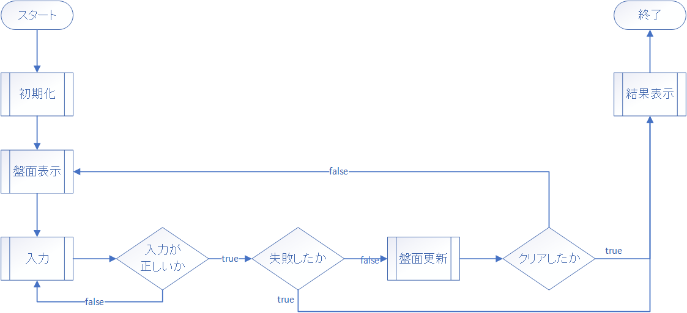

# 手を動かして学ぶ！コンピュータアーキテクチャとアセンブリ言語プログラミングの基本

## マインスイーパを作ろう（実装編）

最終回です。ここまで本当にお疲れさまでした。最後にこまごまとした機能の実装をして、それらの結合を行います。それでは参りましょう。

### ここまでの確認

色々機能を実装してきましたが、一旦どこまでできているかの確認をしましょう。マインスイーパ全体のフローチャートをもう一度ご覧ください。



今まで実装してきた関数と対応を考えると、

- 盤面の初期化を行う`INIT` ⇔ 初期化
- 盤面の表示を行う`SHOWF` ⇔ 盤面表示
- 入力プロンプトを表示する`INPUT` ⇔ 入力
- 入力をもとに盤面の更新を行う`OPEN` ⇔ 盤面更新

となっており、後は

- 機能を呼び出すメインルーチン
- クリアを判定する機能
- 結果の表示する機能

ですね、後`SHOWF`関数もまだ完全ではないのでそれのアップデートを行います。

### `SHOWF`関数のアップデート

`SHOWF`関数はまだ大事な機能の実装が行われていません。それは周辺に爆弾があったときその個数を表示する機能です。この実装は周辺の爆弾の数を取得する関数の実装が無ければ行えなかったのでこの段階になってしまいました。

早速実装していきましょう。`show_field.fe`を開いてください。

```
PGM     START
        LAD     GR1, 3
        LAD     GR2, 3
        LD      GR3, EMPTY
        CALL    SET
        LAD     GR1, 6
        LAD     GR2, 7
        LD      GR3, BOMB
        CALL    SET
        CALL    SHOWF
        RET

SHOWF   RPUSH   1, 7
        LAD     GR1, 0          ; x
        LAD     GR2, 0          ; y
        LD      GR3, WIDTH      ; limit_x
        LD      GR4, HEIGHT     ; limit_y
        LAD     GR5, 0          ; v
        
        LAD     GR6, 0          ; stdout_char
        LAD     GR7, '\n'       ; line feed
        
        
        OUT     ='012345678\n', =10
        
        CPA     GR2, GR4
        JMI     OUTFORL
        JUMP    OUTFORE
OUTFOR  ADDA    GR2, =1
        CPA     GR2, GR4
        JMI     OUTFORL
        JUMP    OUTFORE
OUTFORL LAD     GR1, 0
        
        CPA     GR1, GR3
        JMI     INFORL
        JUMP    INFORE
INFOR   ADDA    GR1, =1
        
        CPA     GR1, GR3
        JMI     INFORL
        JUMP    INFORE
INFORL  CALL    GET
        LD      GR5, GR0

        CPA     GR5, UNCHK      ; if V != Uncheck
        JNZ     NTUNCK          ;     then goto NTUNCK
        LD      GR5, CUNCHK     ; V = '#'
        JUMP    INFORLE         ; goto INFORLE

NTUNCK  CPA     GR5, EMPTY      ; if V != Empty
        JNZ     NTEMPTY         ;     then goto NTEMPTY
        LD      GR5, CEMPTY     ; V = ' '
        JUMP    INFORLE         ; goto INFORLE

NTEMPTY LD      GR5, CBOMB      ; V = '@'
        JUMP    INFORLE         ; goto INFORLE

INFORLE WRITE   GR6, GR5        ; print %c, V
        JUMP    INFOR           ; continue

INFORE  LD      GR5, GR2
        ADDA    GR5, ='a'
        WRITE   GR6, GR5
        
        WRITE   GR6, GR7
        
        JUMP    OUTFOR
OUTFORE JUMP    SHOWFE
        
SHOWFE  RPOP    1, 7
        RET

GET     RPUSH   1, 2
        MULA    GR2, WIDTH
        ADDA    GR1, GR2
        LD      GR0, FIELD, GR1
        RPOP    1, 2
        RET

SET     RPUSH   1, 2
        MULA    GR2, WIDTH
        ADDA    GR1, GR2
        ST      GR3, FIELD, GR1
        RPOP    1, 2
        RET


WIDTH   DC      9
HEIGHT  DC      9
FIELD   DS      81

UNCHK   DC      0
EMPTY   DC      1
BOMB    DC      2
CUNCHK  DC      '#'
CEMPTY  DC      ' '
CBOMB   DC      '@'

        END
```

注目してほしいのは内側ループの条件分岐部分。`NTUNCK`の中で`V`に空白を入れるところがありますが、この辺りを改造して数値の表示が出来るようにします。

- 要素が空だったとき、周辺の爆弾の個数を取得します。
- もし周辺に爆弾が無かったら空白を読み込みます。
- もし周辺に爆弾があったらその個数を表示します。

他の所を省略しますが、`CHKBMB`関数の実装を行ったものをまず用意します。`ISEXSIT`関数と`ONE`変数と`ZERO`変数も忘れずに。

```
; PGM 省略

SHOWF   RPUSH   1, 7
        LAD     GR1, 0          ; x
        LAD     GR2, 0          ; y
        LD      GR3, WIDTH      ; limit_x
        LD      GR4, HEIGHT     ; limit_y
        LAD     GR5, 0          ; v
        
        LAD     GR6, 0          ; stdout_char
        LAD     GR7, '\n'       ; line feed
        
        
        OUT     ='012345678\n', =10
        
        CPA     GR2, GR4
        JMI     OUTFORL
        JUMP    OUTFORE
; OUTFOR 省略
; OUTFORL 省略
; INFOR 省略
; INFORL 省略

NTUNCK  CPA     GR5, EMPTY      ; if V != Empty
        JNZ     NTEMPTY         ;     then goto NTEMPTY
        LD      GR5, CEMPTY     ; V = ' '
        JUMP    INFORLE         ; goto INFORLE

; NTEMPTY 省略
; INFORLE 省略

; INFORE 省略
; OUTFORE 省略
; SHOWFE 省略

; CHKBMB 省略
; ISEXIST 省略
; GET 省略
; SET 省略

ZERO    DC      0
ONE     DC      1
; 変数　省略

        END
```

分岐を作ります。まずは周辺に爆弾が無い場合です。これは元の実装をそのまま使います。`GET`関数を事前に呼んでいるので、`GR1`と`GR2`には座標が入っているはず。なので`CHKBMB`関数は呼び出すだけです。

```
NTUNCK  CPA     GR5, EMPTY      ; if V != Empty
        JNZ     NTEMPTY         ;     then goto NTEMPTY
        CALL    CHKBMB          ; if checkBomb() == 0
        CPA     GR0, ZERO       ;     then goto EMPTSP
        JZE     EMPTSP
        
        
        
        JUMP    INFORLE         ; goto INFORLE
; EMPTy SPace
EMPTSP  LD      GR5, CEMPTY     ; V = ' '
        JUMP    INFORLE         ; goto INFORLE
```

数値の表示をします。`GR5`に文字型として数字を入れればよいのですが、`CHKBMB`関数の返却値は数値なので文字へ変換したいと思います。具体的には`'0'`が`48`なので返却値である`GR0`に`48`を加算します。

```
NTUNCK  CPA     GR5, EMPTY      ; if V != Empty
        JNZ     NTEMPTY         ;     then goto NTEMPTY
        CALL    CHKBMB          ; R = checkBomb()
        CPA     GR0, ZERO       ; if R == 0
        JZE     EMPTSP          ;     then goto EMPTSP
        
        ADDA    GR0, ='0'       ; R += '0'
        LD      GR5, GR0        ; V = R
        
        JUMP    INFORLE         ; goto INFORLE
; EMPTy SPace
EMPTSP  LD      GR5, CEMPTY     ; V = ' '
        JUMP    INFORLE         ; goto INFORLE
```

実装できました。`PGM`を少し変えて上手くできているかやってみます。

```
PGM     START
        LAD     GR1, 3          ; FIELD[3][3] = Empty
        LAD     GR2, 3
        LD      GR3, EMPTY
        CALL    SET
        
        LAD     GR1, 3          ; FIELD[4][3] = Bomb
        LAD     GR2, 4
        LD      GR3, BOMB
        CALL    SET
        
        LAD     GR1, 4          ; FIELD[2][4] = Bomb
        LAD     GR2, 2
        LD      GR3, BOMB
        CALL    SET
        
        LAD     GR1, 7          ; FIELD[6][7] = Empty
        LAD     GR2, 6
        LD      GR3, EMPTY
        CALL    SET
        
        CALL    SHOWF
        RET
```

実行してみます。

```
> python mlfe.py show_field.fe
012345678
#########a
#########b
####@####c
###2#####d
###@#####e
#########f
####### #g
#########h
#########i
```

周りに爆弾がある時は数字が表示されて、無いときは空白が出力されています。OKです。次へ行きましょう。

### クリアを判定する機能

クリアを判定する機能を実装していきます。実装方法はいろいろ考えられますが、マインスイーパのクリア条件が未確認を全て空にすることなので、呼び出されたら盤上の状態を確認してクリアしたかしてないかを判定するような機能にしたいと思います。

- 盤面を一次配列のように扱って、`UNCHK`を探していきます。
- あったらゲームはクリアされていないとしてそのような返却値を返します
- 無かったらゲームはクリアされているのでクリアされているという返却値を返します。

ということは`9*9=81`回のループを行って盤上の検査を行うという感じで良いですね。それでは実装に参ります。

呼出部分とレジスタの初期化です。`GR2`にループ回数を保持するのですが、`81`を即値として直接読み込ませても良いのですが、このように既存の定数から読み込ませた方が間違いがないし読む人に情報を与えるのでこのような書き方にしました。

```
PGM     START
        CALL    CHKCLR
        LAD     GR10, 1
        WRITE   GR10, GR0
        RET

; int CHeckCLeaR()
; GR0: 結果
; GR1: ループカウンタ
; GR2: ループ回数
; GR3: 要素保持
CHKCLR  RPUSH   1, 3
        LAD     GR0, 0
        LAD     GR1, 0
        LD      GR2, WIDTH
        MULA    GR2, HEIGHT
        LAD     GR3, 0
        
; CHeck CLeaR End
CHKCLRE RPOP    1, 3
        RET
    
    
WIDTH   DC      9
HEIGHT  DC      9
FIELD   DS      81

UNCHK   DC      0
EMPTY   DC      1
BOMB    DC      2

ONE     DC      1
        
        END
```

ループを実装します。後で使うのでループ端にもラベルをつけておきます。

```
; PGM 省略

; int CHeckCLeaR()
; GR0: 結果
; GR1: ループカウンタ
; GR2: ループ回数
; GR3: 要素保持
CHKCLR  RPUSH   1, 3
        LAD     GR0, 0
        LAD     GR1, 0
        LD      GR2, WIDTH
        MULA    GR2, HEIGHT
        LAD     GR3, 0
        
; Check Clear LooP
CCLP    CPA     GR1, GR2            ; if GR1 == GR2
        JZE     CHKCLRE             ;     then goto CHKCLRE
        
        
        
; Check Clear LooP Else
CCLPE   ADDA    GR1, ONE            ; GR1 += 1
        JUMP    CCLP                ; continue
        
; CHeck CLeaR End
CHKCLRE RPOP    1, 3
        RET
    
; 変数 省略
        
        END
```

ループの中身を実装します。`GR3`に値を格納してその値が`UNCHK`かどうかを検証します。

```
; PGM 省略

; int CHeckCLeaR()
; GR0: 結果
; GR1: ループカウンタ
; GR2: ループ回数
; GR3: 要素保持
CHKCLR  RPUSH   1, 3
        LAD     GR0, 0
        LAD     GR1, 0
        LD      GR2, WIDTH
        MULA    GR2, HEIGHT
        LAD     GR3, 0
        
; Check Clear LooP
CCLP    CPA     GR1, GR2            ; if GR1 == GR2
        JZE     CHKCLRE             ;     then goto CHKCLRE
        
        LD      GR3, FIELD, GR1     ; GR3 = FIELD[GR1]
        CPA     GR3, UNCHK          ; if GR3 == EMPTY
        JZE     CCFU                ;     then goto CCFE
        JUMP    CCLPE               ;     else goto CCLPE
; Check Clear Find Uncheck
CCFU    LAD     GR0, -1             ; GR0 = False
        JUMP    CHKCLRE             ; goto CHKCLRE
; Check Clear LooP Else
CCLPE   ADDA    GR1, ONE            ; GR1 += 1
        JUMP    CCLP                ; continue
; CHeck CLeaR End
CHKCLRE RPOP    1, 3
        RET
    
; 変数 省略
        
        END
```

実装できました。`check_clear.fe`と保存して一回実行してみましょう。

```
> python mlfe.py check_clear.fe
-1
```

`DS`命令は決まった数の分だけ領域を確保し`0`で初期化します。`UNCHK`は`0`なのでこの関数からすると`UNCHK`があったと判断するというわけです。

変数の方を変えてこの関数が上手く動いているか確認します。

```
UNCHK   DC      1   ; 0 -> 1
EMPTY   DC      0   ; 1 -> 0
BOMB    DC      2
```

このようにすることで`0`が`EMPTY`を表す値となりますのでこの状態だと関数は全てが`EMPTY`だと判断するはずです。

```
> python mlfe.py check_clear.fe
0
```

上手く判断していますね、実装完了です。次行きましょう。

### 結果を表示する機能

結果を表示する機能です。まあ引数でクリアしたかゲームオーバーか確認して、それに応じて「おめでとう」とか「ゲームオーバー」とか表示すればよいのですが、もうちょっと結果表示を装飾したいと思います。

これは対応したターミナルエミュレータを要求するのですが、`ANSIエスケープシーケンス`というものを活用すると、ターミナル上の文字に色を付けたり様々な効果を施すことが出来ます。

今回はこの`ANSIエスケープシーケンス`を使って、ゲームの結果を表示する機能で出力する文字に色をつけたいと思います。

まずは、普通にゲームクリアとゲームオーバーの文字列を出力する関数を作りたいと思います。

```
PGM     START
        LAD     GR1, 0
        CALL    RESULT
        RET

; void Result(int mode)
; GR1: mode/adress_msg
; GR2: format
RESULT  RPUSH   1, 2
        CPA     GR1, ZERO       ; if mode == 0
        JZE     GAMECLR         ;     then goto GAMECLR
        JUMP    GAMEOVR         ;     else goto GAMEOVR
GAMECLR LAD     GR1, MSG_GC     ; adr_msg = MSG_GC
        JUMP    RESULTE         ; goto RESULTE
GAMEOVR LAD     GR1, MSG_GO     ; adr_msg = MSG_GO
RESULTE LD      GR2, STRING     ; format = string
        SVC     printf          ; printf(adr_msg, format)
        RPOP    1, 2
        RET
        
ZERO    DC      0
STRING  DC      's'
MSG_GC  DC      'CONGRATULATIONS\n\0'
MSG_GO  DC      'GAMEOVER\n\0'
        END
```

`printf`は`GR1`に出力するメモリの先頭番地、`GR2`に出力フォーマットを指定します。文字列の場合は区切り文字であるヌル文字`\0`まで読んでいきます。復習ですね。

`result_game.fe`と保存しました。実行してみましょう。

```
> python mlfe.py result_game.fe
CONGRATULATIONS
```

一応もう片方もテストしておきましょう。`PGM`の`LAD GR1, 0`を`LAD GR1, 1`に変更して実行してみます。

```
> python mlfe.py result_game.fe
GAMEOVER
```

これでも良いのですが、何か味気ないですよね。そんな時は`ANSIエスケープシーケンス`を使って文字に効果を付けてみましょう。

フォーマットとしては以下の通りです。文字列の先頭にこれを付けると`ANSIエスケープシーケンス`を適用すると出力環境に命令します。

```
\e[nX

\e: エスケープシーケンス、ASCIIコードでは27
[ : 角括弧(bracket)の左側
n : 数値、フォーマットXのモードを指定する
X : フォーマット文字、どんな操作をするかを指定する
```

一部だけどんなフォーマットがあるかご紹介したいと思います。この規格は`ANSI X3.64`と呼ばれているので、詳細を調べたい方はその規格を調べてみてください。

|フォーマット文字|意味|n|
|:--------:|:--:|:-|
|nJ|画面消去|0: カーソルより後ろを消去<br> 1: カーソルより前を消去<br> 2: 画面全体を消去|
|nK|行消去|0: カーソルより後ろを消去<br> 1: カーソルより前を消去<br> 2: 行全体を消去|
|nm|文字効果|0: 文字効果をリセット<br> 1: 太字<br>2: うすく表示<br>3: 斜体<br>4: アンダーライン<br>5: 点滅<br>6: 高速点滅<br>7: 文字色と背景色の反転<br>8: 表示を隠す<br>9: 打ち消し線|
|3nm|文字色|0: 黒<br>1: 赤<br>2: 緑<br>3: 黄色<br>4: 青<br>5: マゼンタ<br>6: シアン<br>7: 白<br>|
|4nm|背景食|0: 黒<br>1: 赤<br>2: 緑<br>3: 黄色<br>4: 青<br>5: マゼンタ<br>6: シアン<br>7: 白<br>|

今回はクリアしたときのメッセージは緑色、ゲームオーバーの時は赤に文字をしてみます。

まずは`MSG_GC`です。エスケープシーケンスの`\e`、角括弧`[`、緑色を表す`32m`と先頭に記述します。

```
MSG_GC  DC      '\e[32mCONGRATULATIONS\n\0'
```

これで実行してみます。私は`Windows Terminal`で実行していますが、このようになりませんか？


文字が緑色になっています。実はエスケープシーケンスによる画面効果はプログラムが終了しても永続します。これでは他のモノを実行するときに邪魔になってしまうので、文字列の最後に文字効果を消すエスケープシーケンスを挿入します。末尾の`\n`と`\0`の間に記述してください。

```
MSG_GC  DC      '\e[32mCONGRATULATIONS\n\e[0m\0'
; \nと\0の間に\e[0mと記述する
```

それでは実行してみます。


正しくできてます。ゲームオーバーの文字列も適用しましょう。赤色は`\e[31m`です。

```
MSG_GO  DC      '\e[31mGAMEOVER\n\e[0m\0'
```


上手くできています。実装完了です。上手く実行できなかったらただの文字列出力だけでもOKです。臨機応変に行きましょう。

### メインルーチンの実装と機能結合

最後になりました。全ての機能の実装が完了したので、それらを呼び出すメインルーチンを書きたいと思います。それでは行きます。

まず実装した関数を記述していきます。`INIT`、`SHOWF`、`INPUT`、`OPEN`を記述します。

```
PGM     START
        CALL    MAIN
        RET

MAIN    NOP
MAINED  RET

; INIT
; SHOWF
; INPUT
; SHOWF
        END

```

次にさらに細かい関数群`GET`、`SET`、`CHKBMB`、`ISINF`、`ISEXIST`を実装します。

```
PGM     START
        CALL    MAIN
MAINED  RET

MAIN    NOP
        RET

; INIT
; SHOWF
; INPUT
; OPEN

; GET
; SET
; CHKBMB
; ISINF
; ISEXIST

        END
```

さきほど実装した、`CHKCLR`、`RESULT`関数の実装も行います。

```
PGM     START
        CALL    MAIN
        RET

MAIN    NOP
MAINED  RET

; INIT
; SHOWF
; INPUT
; OPEN

; GET
; SET
; CHKBMB
; ISINF
; ISEXIST

; CHKCLR
; RESULT

        END
```

また、変数を記述します。これで必要な既存の機能の記述が完了しました。

```
PGM     START
        CALL    MAIN
        RET

MAIN    NOP
MAINED  RET

; INIT
; SHOWF
; INPUT
; OPEN

; GET
; SET
; CHKBMB
; ISINF
; ISEXIST

BUFIN   DS      2

WIDTH   DC      9
HEIGHT  DC      9

FIELD   DS      81
NBOMB   DC      10

UNCHK   DC      0
EMPTY   DC      1
BOMB    DC      2
CUNCHK  DC      '#'
CEMPTY  DC      ' '
CBOMB   DC      '@'

ONE     DC      1
ZERO    DC      0

STRING  DC      's'
MSG_GC  DC      '\e[32mCONGRATULATIONS\n\e[0m\0'
MSG_GO  DC      '\e[31mGAMEOVER\n\e[0m\0'

        END
```

足りないものがあるかどうかはエラーが教えてくれます。`-d`オプションを付けて展開したときに、`This Label have not been Resolved by Name`というエラーが出ていなければ全て記述することが出来ています。

`MAIN`へ行きます。初期化を呼び出します。

```
PGM     START
        CALL    MAIN
        RET

MAIN    CALL    INIT            ; init()
MAINED  RET

; 関数 省略
; 変数 省略
```

盤面の表示を行います。何度も呼び出すのでラベルもつけておきましょう。

```
; PGM 省略

MAIN    CALL    INIT
MAINLP  CALL    SHOWF           ; show_field()
        
        
        
MAINED  RET

; 関数 省略
; 変数 省略
```

入力プロンプトと入力チェックを記述します。

```
; PGM 省略

MAIN    CALL    INIT
MAINLP  CALL    SHOWF
MAINIP  CALL    INPUT           ; R = input()
        CPA     GR0, ZERO       ; if R != 0
        JNZ     MAINIP          ;     then goto MAINIP
        
        
        
MAINED  RET

; 関数 省略
; 変数 省略
```

入力した座標が爆弾にあたっていないか判定します。レジスタを使うので先頭と末尾でレジスタ退避をしておきます。

```
; PGM 省略

MAIN    RPUSH   1, 3
        CALL    INIT
MAINLP  CALL    SHOWF
MAINIP  CALL    INPUT
        CPA     GR0, ZERO
        JNZ     MAINIP
        
        LD      GR1, BUFIN      ; X = BUFIN[0]
        LAD     GR3, 1
        LD      GR2, BUFIN, GR3 ; Y = BUFIN[1]
        CALL    GET             ; V = FIELD[Y][X]
        CPA     GR0, BOMB       ; if V == Bomb
        JZE     MAINGO          ;     then goto MAIN GameOver
        
        
MAINGO  NOP
        
MAINED  RPOP    1, 3
        RET

; 関数 省略
; 変数 省略
```

盤面を更新とクリア判定をします。

```
; PGM 省略

MAIN    RPUSH   1, 3
        CALL    INIT
MAINLP  CALL    SHOWF
MAINIP  CALL    INPUT
        CPA     GR0, ZERO
        JNZ     MAINIP
        
        LD      GR1, BUFIN
        LAD     GR3, 1
        LD      GR2, BUFIN, GR3
        CALL    GET
        CPA     GR0, BOMB
        JZE     MAINGO
        
        CALL    OPEN            ; open()
        CALL    CHKCLR          ; R = checkClear()
        CPA     GR0, ZERO       ; if R == 0
        JZE     MAINGC          ;     then goto MAIN GameClear
        
MAINGC  NOP
        
MAINGO  NOP
        
MAINED  RPOP    1, 3
        RET

; 関数 省略
; 変数 省略
```

結果表示の所を記述します。盤面を表示した後結果の表示をしたいと思います。

```
; PGM 省略

MAIN    RPUSH   1, 3
        CALL    INIT
MAINLP  CALL    SHOWF
MAINIP  CALL    INPUT
        CPA     GR0, ZERO
        JNZ     MAINIP
        
        LD      GR1, BUFIN
        LAD     GR3, 1
        LD      GR2, BUFIN, GR3
        CALL    GET
        CPA     GR0, BOMB
        JZE     MAINGO
        
        CALL    OPEN
        CALL    CHKCLR
        CPA     GR0, ZERO
        JZE     MAINGC
        
        
MAINGC  LAD     GR1, 0          ; mode = GameClear
        JUMP    MAINED          ; goto MAINED
        
MAINGO  LAD     GR1, 1          ; mode = GameOver
        
MAINED  CALL    SHOWF           ; show_field()
        CALL    RESULT          ; result(mode)
        RPOP    1, 3
        RET

; 関数 省略
; 変数 省略
```

クリアでもゲームオーバーでもない継続の時の盤面表示へ帰る`JUMP`を記述します。

```
; PGM 省略

MAIN    RPUSH   1, 3
        CALL    INIT
MAINLP  CALL    SHOWF
MAINIP  CALL    INPUT
        CPA     GR0, ZERO
        JNZ     MAINIP
        
        LD      GR1, BUFIN
        LAD     GR3, 1
        LD      GR2, BUFIN, GR3
        CALL    GET
        CPA     GR0, BOMB
        JZE     MAINGO
        
        CALL    OPEN
        CALL    CHKCLR
        CPA     GR0, ZERO
        JZE     MAINGC
        
        JUMP    MAINLP          ; continue
        
MAINGC  LAD     GR1, 0
        JUMP    MAINED
        
MAINGO  LAD     GR1, 1
        
MAINED  CALL    SHOWF
        CALL    RESULT
        RPOP    1, 3
        RET

; 関数 省略
; 変数 省略
```

まだ完成していませんが、とりあえずは動きます、ちょっと実行してみます。

```text
> python mlfe.py mine_sweeper.fe
012345678
#@#######a
@########b
########@c
####@##@#d
###@##@##e
##@######f
#########g
@#######@h
#########i
[0-8][a-i]> 0a
012345678
2@#######a
@########b
########@c
####@##@#d
###@##@##e
##@######f
#########g
@#######@h
#########i
[0-8][a-i]> 3b
012345678
2@1      a
@21    11b
11 11112@c
  12@##@#d
 12@##@##e
 1@######f
12#######g
@#######@h
#########i
[0-8][a-i]>
```

ゲームの途中で止めました。爆弾が見えているのと、盤面表示どうしがくっついていてちょっと見にくいですね。爆弾が見えているのはデバッグ用に残すとして、盤面がくっついているのを離したいと思います。

`GR4`と`GR5`に改行用の値を入れておいて、盤面表示を呼び出す`MAINLP`の先頭に`WRITE`命令を記述します。使うレジスタが増えたので先頭と末尾の`RPUSH`、`RPOP`も更新します。

```
; PGM 省略

MAIN    RPUSH   1, 5
        
        LAD     GR4, 0          ; stdout_char
        LAD     GR5, '\n'       ; line feed
        
        CALL    INIT
MAINLP  WRITE   GR4, GR5        ; print line feed
        CALL    SHOWF
MAINIP  CALL    INPUT
        CPA     GR0, ZERO
        JNZ     MAINIP
        
        LD      GR1, BUFIN
        LAD     GR3, 1
        LD      GR2, BUFIN, GR3
        CALL    GET
        CPA     GR0, BOMB
        JZE     MAINGO
        
        CALL    OPEN
        CALL    CHKCLR
        CPA     GR0, ZERO
        JZE     MAINGC
        
        JUMP    MAINLP
        
MAINGC  LAD     GR1, 0
        JUMP    MAINED
        
MAINGO  LAD     GR1, 1
        
MAINED  CALL    SHOWF
        CALL    RESULT
        RPOP    1, 5
        RET

; 関数 省略
; 変数 省略
```

```text
> python mlfe.py mine_sweeper.fe

012345678
######@##a
#####@###b
#########c
@#@@#####d
#####@###e
#########f
#######@#g
@@####@##h
#########i
[0-8][a-i]> 0a

012345678
    1#@##a
    1@###b
12222####c
@#@@#####d
#####@###e
#########f
#######@#g
@@####@##h
#########i
[0-8][a-i]> 8i

012345678
    1#@##a
    1@###b
12222####c
@#@@#####d
#####@###e
#########f
#######@#g
@@####@21h
#######1 i
[0-8][a-i]> 3h

012345678
    1#@##a
    1@###b
12222####c
@#@@#####d
12222@###e
    11###f
221  1#@#g
@@1  1@21h
##1  1#1 i
[0-8][a-i]>
```

圧倒的に見やすくなりましたね。きちんとクリアできるか、ゲームオーバーになるか試します。

```text
> python mlfe.py mine_sweeper.fe

012345678
#########a
@########b
####@###@c
#######@#d
####@####e
#########f
#@#######g
##@#@####h
###@#@###i
[0-8][a-i]> 0a

012345678
1########a
@########b
####@###@c
#######@#d
####@####e
#########f
#@#######g
##@#@####h
###@#@###i
[0-8][a-i]> 2a

012345678
11       a
@1 111 11b
11 1@112@c
   2###@#d
   1@####e
1111#####f
#@#######g
##@#@####h
###@#@###i
[0-8][a-i]> 

以降省略
```


```text
> python mlfe.py mine_sweeper.fe

012345678
##@######a
######@##b
#########c
#########d
#########e
#@#######f
@#@@##@##g
#########h
#@####@@#i
[0-8][a-i]> 4d

012345678
 1@1 1#1 a
 111 1@1 b
     111 c
         d
111      e
#@321111 f
@#@@##@1 g
#######31h
#@####@@#i
[0-8][a-i]> 3g
```


出来てます。あとは爆弾を隠すだけです。爆弾の文字である`CBOMB`を初期値では`#`と未確認と同じ文字にしておいて、最後の結果表示の`SHOWF`の直前に`CBOMB`の値を`@`に切り替えて表示させれば、私たちの想像するマインスイーパになりますね。

```
MAIN    RPUSH   1, 5
        
        LAD     GR4, 0
        LAD     GR5, '\n'
        
        CALL    INIT
MAINLP  WRITE   GR4, GR5
        CALL    SHOWF
MAINIP  CALL    INPUT
        CPA     GR0, ZERO
        JNZ     MAINIP
        
        LD      GR1, BUFIN
        LAD     GR3, 1
        LD      GR2, BUFIN, GR3
        CALL    GET
        CPA     GR0, BOMB
        JZE     MAINGO
        
        CALL    OPEN
        CALL    CHKCLR
        CPA     GR0, ZERO
        JZE     MAINGC
        
        JUMP    MAINLP
        
MAINGC  LAD     GR1, 0
        JUMP    MAINED
        
MAINGO  LAD     GR1, 1
        
MAINED  LAD     GR3, '@'        ; V = '@'
        ST      GR3, CBOMB      ; CBOMB = V
        CALL    SHOWF
        CALL    RESULT
        RPOP    1, 5
        RET

; 関数省略
; 変数省略
CBOMB   DC      '#'             ;
```

完成です。上手く動くでしょうか。

```text
> python mlfe.py mine_sweeper.fe

012345678
#########a
#########b
#########c
#########d
#########e
#########f
#########g
#########h
#########i
[0-8][a-i]> 0a

012345678
   1#####a
 113#####b
 1#######c
 112#####d
   1#####e
   1#####f
  12#####g
  1######h
  1######i
[0-8][a-i]> 2c
```


これはまごうことなきマインスイーパですね。おめでとうございます。長かったですね、お疲れ様です。是非クリアはご自身の手でやってみてください。

これでこの教科書は完全終了です。本当にお疲れさまでした。少しはアセンブリ言語に自信ができましたか？もうちょっとMLFEで遊んでも良いですし、じゃあインテルCPUの勉強をするからという方もいらっしゃるでしょうし、MLFEで動くアセンブリを出力するコンパイラを作ろうという方もいらっしゃるかもしれません、MLFEをFPGA上に再現して実機で動かしたいという方もいるかも、そうです、ここから結構いろんな勉強に派生して行けるのがこのアセンブリ言語を学習することの良さなのです。

理解しながらやりきったあなたは他のプログラマの方とはちょっと違う目線でこれからコーディングすることになるでしょう。演算順序ってこんな風に実装されているんだろうな、とかじゃあ構造体とか列挙型ってこういう風に実装されているんだろうなとか思いを馳せることが出来るはずです。それはとても大きな第一歩だと私は思いますし、その第一歩を踏み出せたならこのシミュレータやマニュアル・教科書を製作した甲斐があったというものです。

あらためて本当にお疲れさまでした。この教科書が貴方様の何かの役に立てば幸いです。ありがとうございました。

## まとめ
- `ANSIエスケープシーケンス`は使いこなせると便利
- `Happy Programming!`
